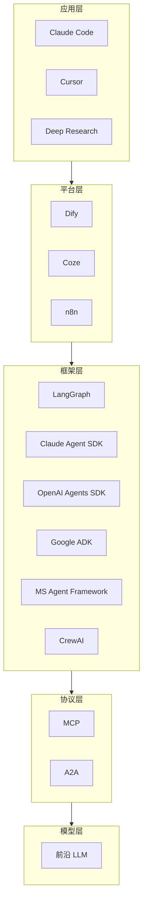
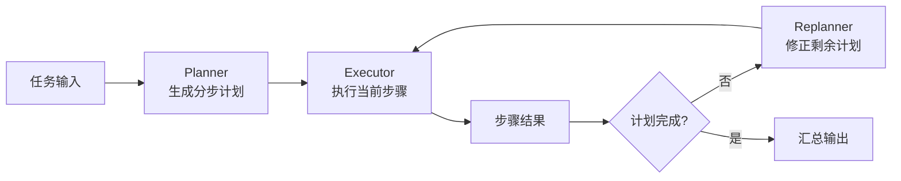
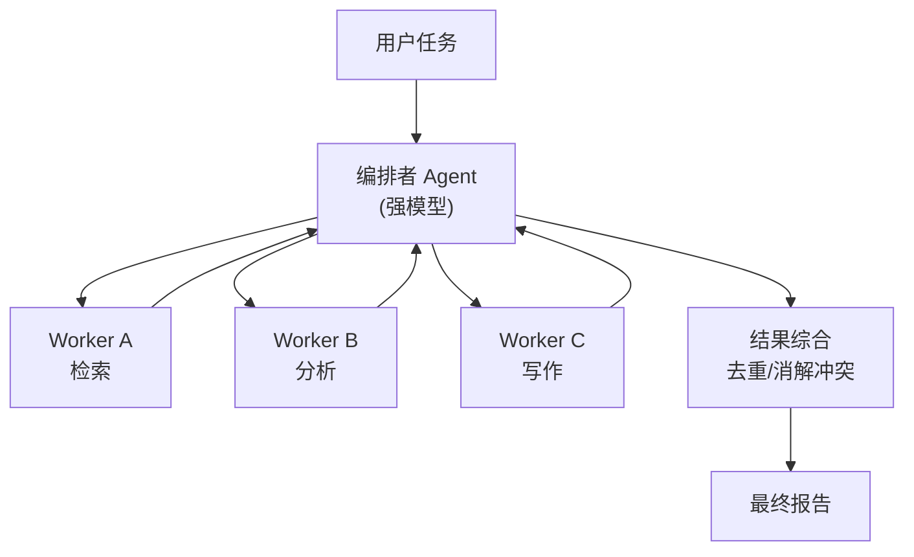
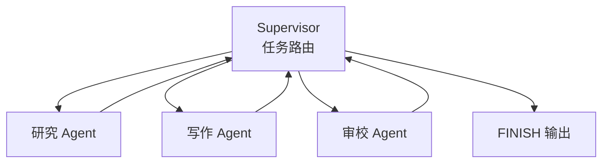
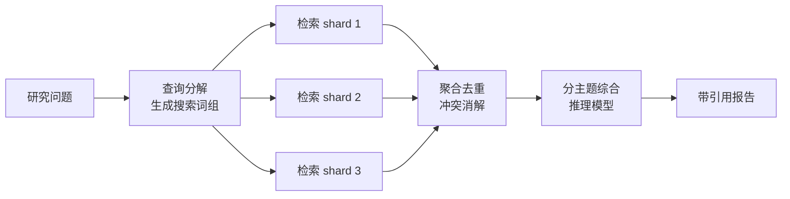
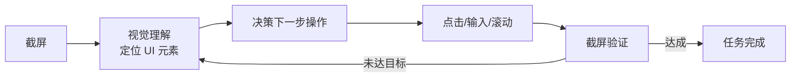
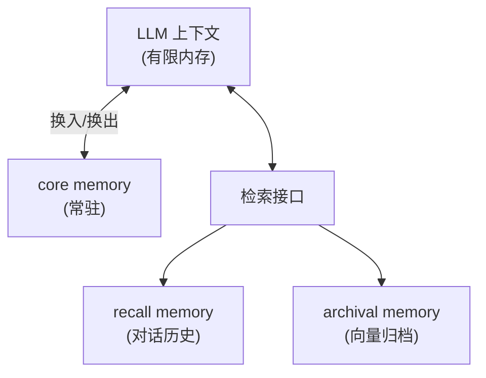
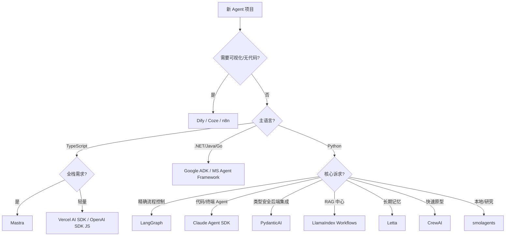

# 智能体框架与架构

> 本文是 `07-AI智能体Agent.md` 的深度扩展：系统梳理 2026 年主流智能体框架与各类智能体架构模式。

## 1. 智能体技术栈全景（2026）

### 五层技术栈

| 层级 | 组成 | 代表 |
|------|------|------|
| 模型层 | 推理引擎 | GPT/Claude/Gemini/Qwen/GLM 等前沿模型 |
| 协议层 | 标准化连接 | MCP（AI→工具）、A2A（Agent↔Agent）、Agent Card |
| 框架层 | 编排与执行 | LangGraph、Claude Agent SDK、ADK、MSAF、CrewAI |
| 平台层 | 托管与可视化 | Dify、Coze、n8n、LangFlow、Vertex AI |
| 应用层 | 终端产品 | Claude Code、Cursor、Deep Research 类产品 |

### 框架演进时间线

- **2023**：AutoGen 开创多 Agent 对话；BabyAGI/AutoGPT 引爆自主 Agent 想象
- **2024**：CrewAI 角色协作走红；LangChain 拆分出 LangGraph；MCP 发布
- **2025**：框架"SDK 化"收敛（OpenAI Swarm→Agents SDK、AutoGen→MSAF）；LangGraph 1.0；A2A 捐赠 Linux Foundation；轻量类型安全框架崛起（PydanticAI、smolagents、Agno）
- **2026**：协议标准化落地（MCP 2026-07 新规范、A2A 规模采用）；四大官方 SDK 全面 GA；生产化与可观测性成为主战场



## 2. 智能体架构模式总览

| 架构模式 | 核心思想 | 适用场景 | 代表实现 |
|---------|---------|---------|---------|
| ReAct 单循环 | 思考→行动→观察迭代 | 通用任务 | 所有框架默认模式 |
| Plan-and-Execute | 先全局规划再逐步执行 | 长任务、可预测流程 | LangGraph、BabyAGI |
| Reflexion 自我反思 | 失败后语言反思再重试 | 高正确率要求 | Reflexion 论文、LATS |
| 树搜索 | ToT/MCTS 多路径探索 | 需全局最优决策 | LATS、ToT |
| 编排者-工作者 | 主 Agent 动态分解派发 | 开放式复杂任务 | Claude Code 子 Agent |
| 层级 Supervisor | 固定管理链逐级下达 | 企业级多团队 | LangGraph Supervisor |
| 顺序流水线 | 固定工序串联 | 内容生产流水线 | CrewAI Process.sequential |
| 并行 Map-Reduce | 分片并行+汇总 | 批量处理 | LangGraph Send API |
| 辩论式 | 多 Agent 互相驳斥收敛 | 事实性/审查类 | Multi-Agent Debate |
| 投票共识 | 多数表决降方差 | 高可靠性判断 | Mixture of Agents |
| Swarm Handoff | 轻量接力转移控制权 | 客服路由 | OpenAI Agents SDK |
| 群聊 GroupChat | 共享对话+主持人调度 | 头脑风暴 | AutoGen/MSAF |
| 黑板模式 | 共享状态空间异步读写 | 复杂协同 | A2A Agent Board |
| 生成器-验证器 | Actor 产出 Critic 把关 | 代码/数学 | Claude Code 测试循环 |
| 记忆增强 | OS 式分页管理上下文 | 长期陪伴型 | Letta (MemGPT) |
| Deep Research | 规划→并行检索→综合成文 | 研究报告 | OpenAI/Gemini DR |
| Computer Use | 视觉感知→GUI 操作循环 | 桌面/浏览器自动化 | Claude Computer Use |
| Coding Agent | 定位→编辑→测试→修复 | 软件工程 | Claude Code、SWE-agent |

## 3. 单智能体架构

### 3.1 ReAct 单循环架构
- **结构**：LLM 在循环中交替产生 Thought / Action / Observation
- **优点**：实现简单、可调试、是所有框架的默认执行模式
- **缺点**：缺乏全局规划，长任务容易"迷路"（上下文膨胀、目标漂移）
- **2026 趋势**：前沿模型推理能力增强后，纯 ReAct + 好工具描述已能解决大量任务，"少框架、强模型"路线回归

### 3.2 Plan-and-Execute 架构
- **结构**：Planner 一次性生成任务列表 → Executor 逐步执行 → Replanner 动态修正
- **优点**：全局视野、步数可控、中间结果可检查点保存
- **缺点**：规划质量依赖模型；环境突变需重规划
- **代表**：LangGraph Plan-and-Execute 模板、BabyAGI



### 3.3 Reflexion 自我反思架构
- **结构**：Actor 执行 → Evaluator 打分 → Self-Reflexion 生成语言化经验 → 存入情景记忆 → 下一轮尝试参考
- **要点**：反思以自然语言而非梯度形式沉淀"失败教训"
- **适用**：代码生成、决策任务等有明确成败信号的场景
- **变体**：CRITIC（借助工具反馈反思）、Self-Refine（自评自改）

### 3.4 树搜索架构（ToT / MCTS / LATS）
- **ToT**：思维展开为树，BFS/DFS + 每节点自评打分回溯
- **MCTS**：蒙特卡洛树搜索 + LLM 价值评估，算力换正确率
- **LATS**：将 ReAct 轨迹作为树节点，融合反思与环境反馈，统一了 ReAct/Reflexion/ToT
- **代价**： token 成本成倍增长，用于离线高价值任务

### 3.5 上下文工程架构（Context Engineering）
- 2025-2026 从"Prompt 工程"升级为"上下文工程"
- **核心手段**：
  - **Compaction（压缩）**：长对话自动摘要归档，保留关键指令与事实
  - **Sub-agent 隔离**：把大上下文任务派给子 Agent，只回传结论，保护主上下文
  - **结构化笔记**：Todo/进度文件作为外部"工作记忆"（Claude Code 模式）
  - **Just-in-time 检索**：按需加载上下文而非一次性塞满

## 4. 多智能体架构

### 4.1 编排者-工作者（Orchestrator-Worker）
- **结构**：主 Agent 先规划分解，再动态生成/调度多个 worker（worker 可为临时子 Agent）
- **特点**：任务划分由模型决定而非硬编码，适应开放性问题
- **典型**：Claude Code Research/Subagent 模式、Anthropic 多 Agent 研究系统
- **经验法则**（Anthropic 工程博客）：编排者用强模型，工作者可用轻量模型降成本；worker 数量 2-20 为常见区间

### 4.2 层级式（Hierarchical / Supervisor）
- **结构**：固定组织架构——Supervisor 管理多个职能 Agent，可多级嵌套
- **与编排者-工作者区别**：组织结构预先定义，角色稳定
- **代表**：LangGraph supervisor 库、MSAF Workflow

```python
# LangGraph Supervisor 骨架（示意）
from langgraph.prebuilt import create_react_agent

researcher = create_react_agent(llm, tools=[tavily_search], prompt="研究员：负责检索资料")
writer = create_react_agent(llm, tools=[write_file], prompt="写作员：负责撰写报告")

def supervisor(state):
    # LLM 结构化输出决定下一步路由：researcher / writer / FINISH
    return route_to(state["messages"])

graph = build_supervisor([researcher, writer], supervisor)  # 构建 supervisor 图
```

### 4.3 顺序流水线（Sequential Pipeline）
- **结构**：Predefined 固定工序串联（如：调研→大纲→撰写→审校→排版）
- **优点**：可预测、可审计、每步可缓存与人工卡点
- **代表**：CrewAI `Process.sequential`、MSAF SequentialWorkflow

### 4.4 并行化（Parallelization / Map-Reduce）
- **结构**：同一任务分片并行（Map），结果聚合（Reduce）
- **变体**：Sectioning（分块处理）、Voting（多副本投票）
- **实现**：LangGraph `Send` API 按 key 动态分发、MSAF ParallelWorkflow
- **适用**：批量文档分析、多源检索聚合（Deep Research 内核）

### 4.5 辩论式（Debate）与投票共识（Voting）
- **Debate**：正反方多轮交锋+裁判总结，提升事实性与推理严谨性
- **Voting/MoA**：多个模型独立作答后聚合（Mixture of Agents：proposer 层 + aggregator 层），以算力换正确率
- **适用**：红队审查、高风险决策、评测打分

### 4.6 Swarm / Handoff（接力）
- **结构**：Agent 间通过 `handoff` 工具转移控制权，全量对话历史随之传递
- **特点**：无中心编排器，去中心化、轻量
- **代表**：OpenAI Agents SDK（Swarm 精神续作）、CrewAI Flow
- **适用**：客服路由、多技能分诊

```python
# OpenAI Agents SDK Handoff 示意
from agents import Agent, Runner

billing = Agent(name="账单专员", handoff_description="处理退款与发票",
                instructions="你是账单专家，用中文简短回复")
tech = Agent(name="技术支持", handoff_description="处理故障排查",
             instructions="你是技术专家，先复现问题再给方案")

triage = Agent(
    name="分诊台",
    instructions="根据问题类型转接给账单或技术支持",
    handoffs=[billing, tech],   # 声明可转接目标
)
result = Runner.run_sync(triage, "我上个月被重复扣款了")
```

### 4.7 群聊（GroupChat）
- **结构**：共享消息总线 + 主持人（Manager LLM）选择下一发言者
- **问题**：轮次控制难、token 消耗大、易跑题 → 2026 逐步被工作流编排替代
- **代表**：AutoGen GroupChat（MSAF 中由 MagenticWorkflow 继承）

### 4.8 黑板（Blackboard）模式
- **结构**：共享结构化状态空间（"黑板"），各 Agent 异步读写、认领任务
- **优点**：解耦、天然支持异步与人工介入
- **2026 形态**：A2A 生态中的共享 Agent Board / 任务看板

### 4.9 A2A 跨组织协作架构
- Agent Card（`/.well-known/agent.json`）声明能力
- 任务模型：Task/Artifact/Message 三层抽象，支持长时间任务与推送更新
- 与 MCP 组合公式：**每个 Agent 自身通过 MCP 用工具，Agent 之间通过 A2A 通信**

## 5. 专用智能体架构

### 5.1 Deep Research 架构
```
规划(查询分解) → 并行多源检索(搜索/爬取/数据库) → 去重与冲突消解 → 分主题综合 → 长文撰写(引用溯源) → 自查修订
```
- **代表**：OpenAI Deep Research、Gemini Deep Research、Perplexity
- **要点**：推理模型做规划+综合，廉价模型做抽取；全程带引用防幻觉

### 5.2 Computer Use / GUI Agent 架构
- **循环**：截图（视觉感知）→ 定位元素 → 生成操作（点击/输入/滚动）→ 执行 → 再截图验证
- **代表**：Claude Computer Use、UI-TARS、OSWorld 基准
- **挑战**：延迟高、误操作代价大、需要确认机制与回滚快照

### 5.3 Coding Agent 架构（SWE-agent 范式）
- **循环**：Issue 理解 → 代码定位（grep/read）→ 补丁生成 → 测试执行 → 失败反思 → 迭代
- **代表**：Claude Code、SWE-agent、OpenHands（原 OpenDevin）
- **关键设计**：ACI（Agent-Computer Interface）——为模型定制的精简命令集比原生 shell 更高效；沙箱与最小权限

### 5.4 Agentic RAG 架构
- 检索从"单次召回"升级为"多跳检索-评估-再检索"的 Agent 决策
- 详见 `06-检索增强生成RAG.md` 的 Agentic RAG 章节

### 5.5 记忆增强架构（MemGPT → Letta）
> 完整记忆实现综述见 `11-智能体记忆系统.md`。
- **思想**：把 LLM 上下文当"内存"，外部存储当"磁盘"，模型自主决定换入/换出（self-editing memory）
- **核心块**：core memory（系统级）/ recall memory（对话历史）/ archival memory（向量归档）
- **代表**：Letta（MemGPT 团队商业版）、Mem0、Zep（GraphRAG 时间线记忆）

## 6. 主流框架深度解析

### 6.1 LangGraph（LangChain 系）
- **范式**：显式状态图（StateGraph），节点=函数，边=路由，内置 checkpoint 持久化与人机回环中断
- **2025.10 发布 1.0**：API 稳定，`create_react_agent` 预置 Agent、`Send` API 动态并行
- **适合**：需要精确控制流程、状态回滚、复杂分支的生产系统
- **生态**：LangSmith 全链路追踪；LangGraph Platform/Agent Runtime 托管

```python
from langgraph.graph import StateGraph, START, END
from typing import TypedDict

class State(TypedDict):
    task: str; plan: list; results: list; done: bool

def plan_node(state: State):
    return {"plan": llm_decompose(state["task"])}

def exec_node(state: State):
    step = state["plan"][len(state["results"])]
    return {"results": state["results"] + [run_tool(step)]}

def route(state: State):
    return END if len(state["results"]) >= len(state["plan"]) else "exec"

g = StateGraph(State)
g.add_node("plan", plan_node); g.add_node("exec", exec_node)
g.add_edge(START, "plan"); g.add_edge("plan", "exec")
g.add_conditional_edges("exec", route)
app = g.compile(checkpointer=sqlite_saver)   # 持久化 + 断点恢复
```

### 6.2 Claude Agent SDK（Anthropic）
- **范式**：`query()` 异步生成器流式输出消息/工具调用； hooks 全生命周期拦截；子 Agent 独立上下文
- **内置工具**：Read/Write/Edit/Bash/Glob/Grep/WebSearch/WebFetch
- **适合**：代码 Agent、终端型深度任务（Claude Code 同款内核）

### 6.3 OpenAI Agents SDK
- **范式**：Agent + handoff + guardrails 三原语，极简
- **特性**：tracing 内置、Sessions 记忆、与 Responses API/Realtime 语音集成
- **适合**：轻量路由链、快速原型

### 6.4 Google ADK 1.0（2026.4 GA）
- **四语言对齐**：Python/Java/Go/TypeScript 运行时语义一致
- **Service Registry**：声明式切换存储/记忆后端（内存 ↔ Vertex AI Memory Bank）
- **artifact/记忆/会话**三服务抽象；A2A 原生
- **适合**：企业多语言技术栈、GCP 深度集成

### 6.5 Microsoft Agent Framework 1.0（2026.4，MSAF）
- AutoGen + Semantic Kernel 合并而成，官方继承者
- **范式**：工作流编排（Sequential/Parallel/Magentic）替代 GroupChat；AgentActor 抽象
- **原生 MCP + A2A**；.NET/Python 双语言；Azure 深度集成（OpenTelemetry 可观测）

### 6.6 CrewAI
- **范式**：角色化 Crew（Role/Crew/Task），sequential/hierarchical 流程
- **2026**：v1.14+，A2A 原生、Flow 事件驱动编排、企业版 Control Plane
- **适合**：快速原型、内容生产类流水线

### 6.7 LlamaIndex Workflows
- **范式**：事件驱动（Event/Step），异步天然支持
- **适合**：RAG 中心型应用（检索/索引流水线 + Agent 决策）

### 6.8 PydanticAI
- **范式**：类型安全 Agent（类似 FastAPI 的开发体验），Pydantic 结构化输出/校验
- **特性**：多模型提供商、依赖注入、图迭代（`iter()` 暴露每步事件）
- **适合**：Python 后端团队把 Agent 嵌入现有服务

### 6.9 smolagents（HuggingFace）
- **范式**：CodeAgent——模型直接写 Python 代码作为行动（比 JSON 工具调用少多次往返）
- **极简**：核心仅千行级；可跑在本地开源模型上
- **适合**：研究、本地化部署、教学

### 6.10 Agno（原 Phidata）
- **范式**：高性能多模态 Agent（Agent Team、共享 Session/Memory、内置 RAG）
- **卖点**：低开销（号称比 LangGraph 快一个数量级）、全栈组件齐全

### 6.11 Letta（原 MemGPT）
- **范式**：记忆优先操作系统型 Agent，stateful server + self-editing memory
- **适合**：长期陪伴型/有状态人格化应用

### 6.12 Mastra（TypeScript）
- **范式**：TS 全栈 Agent 框架：workflow + agent + RAG + eval + MCP
- **适合**：前端/Node 团队构建 AI 应用

### 6.13 低代码平台
| 平台 | 定位 | 特点 |
|------|------|------|
| Dify | 可视化工作流 | 开源、RAG+Agent 混排、企业私有化热门 |
| Coze（扣子） | 免代码 Bot | 字节系、插件生态丰富、国内版+海外版 |
| n8n | 自动化流水线 | 400+ 集成、AI Agent 节点、自托管 |
| LangFlow | LangChain 可视化 | 拖拽式、原型演示 |

### 6.14 国内研究生态
- **Qwen-Agent**：Qwen 官方，中文工具调用/代码解释器成熟
- **AgentScope**（阿里）：多 Agent 平台，消息驱动，2025-2026 活跃
- **MetaGPT/CAMEL**：软件公司模拟/角色扮演学术先驱，适合研究复现
- **UltraAgent 等垂直框架**：各行业定制化实现持续涌现

### 6.15 判别式决策模型（Jev / System One）
- **范式**：不做生成、只做判别——输入非结构化状态，输出 Choice/Score/Noul 三类强类型结果 + 校准概率
- **代表**：Jev（TypeSafe AI，2026.9），单步前向 0 生成 token，70-500ms、输入 $0.042/M token、输出免费
- **角色**：Agent 架构中的 System 1 反射层——意图路由、安全门控、工具调用守卫、循环检测
- 详见 `12-Jev与SystemOne判别模型.md`

## 7. Mermaid 架构图集

### 7.1 编排者-工作者



### 7.2 Supervisor 多级层级



### 7.3 Deep Research 流水线



### 7.4 Computer Use 循环



### 7.5 Letta 记忆分页



## 8. 对比表格

### 8.1 框架全景对比（2026）

| 框架 | 语言 | 核心范式 | 多 Agent | MCP | A2A | 持久化/记忆 | 可观测 | 定位 |
|------|------|---------|---------|-----|-----|------------|--------|------|
| LangGraph | Py/TS/JS | 状态图 | 图编排 | 社区 | 社区 | Checkpointer | LangSmith | 生产级流程控制 |
| Claude Agent SDK | Py/TS | 流式生成器 | 子 Agent | 原生 | 否 | Session | OTel 追踪 | 代码/终端 Agent |
| OpenAI Agents SDK | Py/JS | Handoff 链 | Handoff | 插件 | 插件 | Sessions | 内置 Tracing | 轻量快速 |
| Google ADK | Py/Java/Go/TS | Service Registry | 是 | 是 | 原生 | Memory Bank | Cloud Trace | 企业多语言 |
| MS Agent Framework | .NET/Py | 工作流 | 原生 | 原生 | 原生 | 状态服务 | OTel | .NET/Azure |
| CrewAI | Py | 角色 Crew | 原生 | 是 | 原生 | Memory/知识 | Langfuse 等 | 快速原型 |
| LlamaIndex | Py/TS | 事件驱动 | Workflow | 是 | 否 | 存储 | LlamaIndex Deck | RAG 中心 |
| PydanticAI | Py | 类型安全 | 图迭代 | 是 | 否 | 暂存 | Logfire | 后端集成 |
| smolagents | Py | CodeAgent | 是 | 是 | 否 | 可插拔 | 基础 | 轻量/本地 |
| Agno | Py | 高性能组件 | Agent Team | 是 | 是 | 共享记忆 | Agno/OTel | 全栈低开销 |
| Letta | Py | 记忆 OS | 是 | 是 | 否 | 分层记忆 | 内置 | 有状态长期 Agent |
| Mastra | TS | Workflow | 是 | 原生 | 是 | 存储 | 内置 | TS 全栈 |
| Dify/Coze | 低代码 | 可视化 | 工作流 | 部分 | 部分 | 内置 | 控制台 | 无代码交付 |

### 8.2 架构模式选型表

| 需求特征 | 推荐架构 | 理由 |
|---------|---------|------|
| 任务路径开放、不可预测 | 编排者-工作者 | 动态分解优于硬编码流程 |
| 流程固定、需审计合规 | 顺序流水线/状态图 | 每步可检查点与人工卡点 |
| 批量同构子任务 | 并行 Map-Reduce | 分片并行，聚合降延迟 |
| 高正确率、可容忍成本 | 投票/辩论/树搜索 | 算力换质量 |
| 用户会话路由 | Swarm Handoff | 去中心化轻量接力 |
| 长期个性化陪伴 | 记忆增强(Letta) | 分层记忆跨会话 |
| 报告/综述生成 | Deep Research | 规划+并行检索+综合 |
| 桌面/网页自动化 | Computer Use 循环 | 感知-操作闭环 |
| 单一明确技能 | 单 Agent ReAct | 简单直接，避免过度设计 |

### 8.3 单 Agent vs 多 Agent 决策

| 维度 | 单 Agent | 多 Agent |
|------|---------|---------|
| 上下文隔离 | 共享窗口易膨胀 | 子 Agent 各自隔离，回传结论 |
| 延迟 | 低 | 高（编排+通信开销） |
| 成本 | 低 | 3-15 倍 token |
| 可靠性 | 长任务目标漂移 | 角色聚焦、错误局部化 |
| 调试 | 简单 | 需全链路追踪 |
| **经验** | **优先单 Agent + 子 Agent 兜底** | 工作真正可并行/需多视角时才上 |

## 9. 选型决策树



## 10. 工程实践要点（2026）

- **模型分级**：编排/综合用前沿推理模型，抽取/格式化用轻量模型（成本可降 50%+）
- **上下文预算**：给每个工具结果设截断上限；重要结论摘要后回传主循环
- **幂等与重试**：工具调用设计为幂等，配指数退避；长任务用 checkpoint 支持断点续跑
- **评估驱动**：先建轨迹级 eval（成功率/步数/token/延迟），再谈架构优化
- **安全默认**：MCP 工具声明最小权限；高危操作走人机回环；A2A 跨组织调用签发可撤销凭证
- **反模式**：为"多 Agent"而多 Agent；GroupChat 无主持人放任自流；把全部状态塞进 prompt
