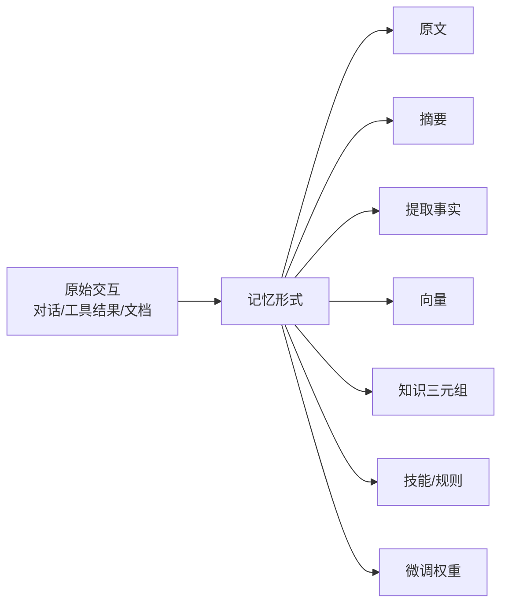
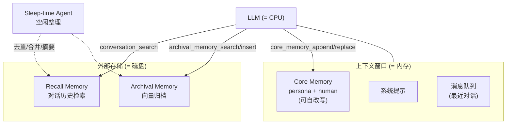
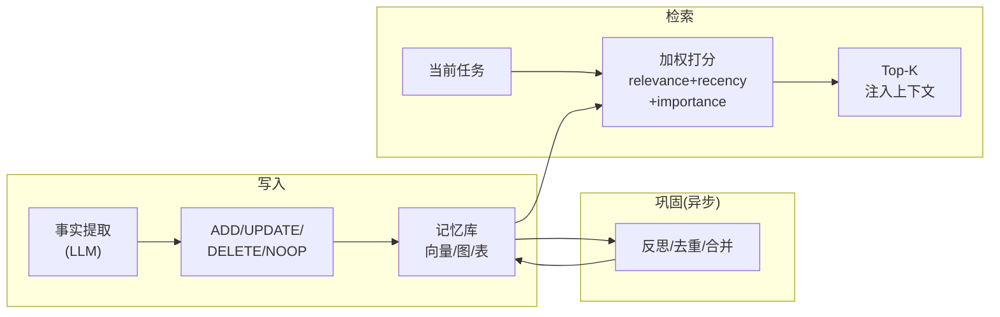
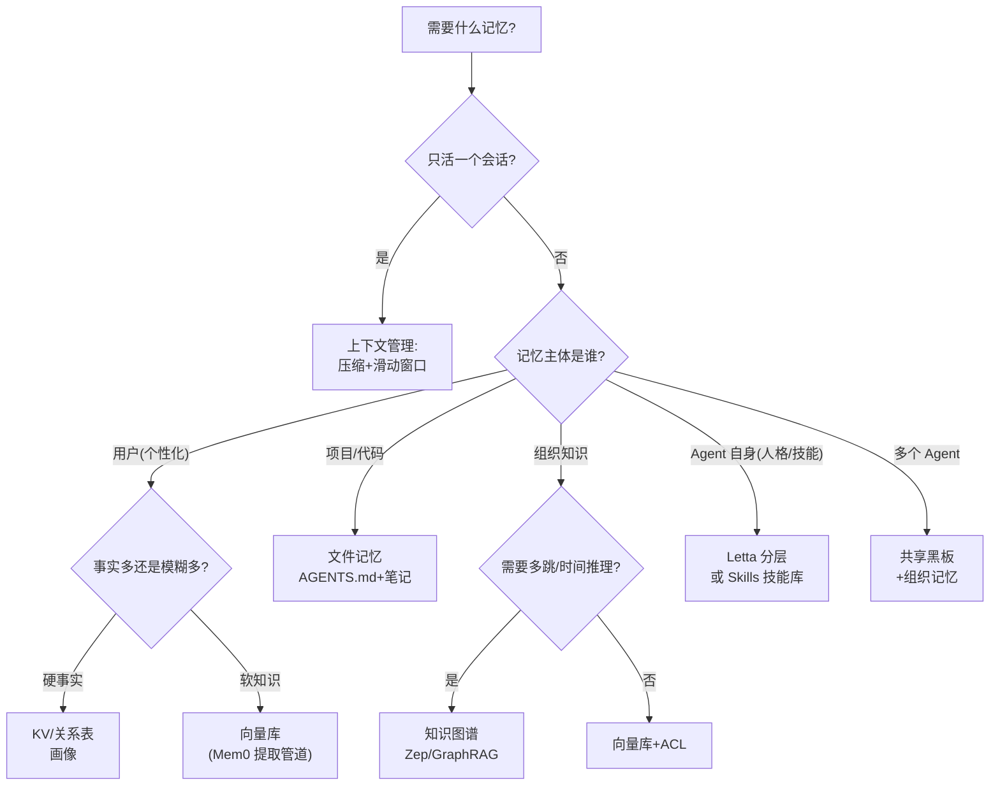

# 智能体记忆系统综述

> 本文是 `07-AI智能体Agent.md` 第 6 节（记忆系统）的深度扩展：系统梳理记忆分类学、九类实现方式、生命周期管理、框架能力对比与场景化记忆模式。

## 1. 为什么 Agent 需要记忆

### 上下文窗口 ≠ 记忆
- **会话失忆**：默认每次对话从零开始，无法延续昨天的承诺
- **成本线性增长**：历史全量塞 prompt，token 费用随轮数线性上升
- **注意力稀释**："Lost in the Middle"——长上下文中间部分检索准确率显著下降
- **窗口再大也有限**：即使 1M token 窗口，也无法覆盖数月交互与全部私有知识

### 记忆解决的四个核心问题
1. **跨会话连续性**：记住上次聊到哪、做过什么决定
2. **个性化**：沉淀用户画像、偏好、习惯，越用越懂你
3. **经验复用**：把成功轨迹/失败教训抽象为可复用技能与规则（少犯重复错误）
4. **身份与目标一致性**：长期目标、承诺、约束不因窗口滚动而丢失

## 2. 记忆分类学

### 2.1 认知科学映射

| 认知类型 | 定义 | Agent 对应实现 | 典型寿命 |
|---------|------|---------------|---------|
| 工作记忆 Working | 当前任务活跃信息 | 上下文窗口 / 系统提示 | 单轮-单会话 |
| 情景记忆 Episodic | 具体经历（何时何地发生了什么） | 对话历史库、事件日志、轨迹存储 | 天-月 |
| 语义记忆 Semantic | 抽象事实与知识 | 向量库、知识图谱、事实表 | 月-永久 |
| 程序记忆 Procedural | 技能与操作方法 | 系统提示词、技能库（Skills）、微调权重、缓存轨迹 | 月-永久 |

### 2.2 按时间跨度

| 层级 | 跨度 | 载体示例 | 淘汰策略 |
|------|------|---------|---------|
| 短期 | 当前会话内 | 上下文、会话状态（LangGraph Checkpointer） | 会话结束归档 |
| 中期 | 跨会话-数周 | 摘要记忆、任务笔记、scratchpad | 被覆盖/合并 |
| 长期 | 数月-永久 | 向量库、知识图谱、用户画像、技能库 | 反思淘汰/合规删除 |

### 2.3 按载体形式
- **文本**：原文存储（保真，检索弱）
- **向量**：嵌入检索（语义泛化，不可读）
- **图**：实体-关系三元组（可多跳推理，构建贵）
- **结构化**：KV/关系表（精确， Schema 刚性）
- **参数化**：微调进权重（隐式、更新慢、不可解释）



## 3. 记忆实现方式详解（九类）

### 3.1 上下文内记忆（In-Context）
- **全量保留**：简单粗暴，适合短会话
- **滑动窗口**：只保留最近 K 轮，实现零成本但"硬截断"丢失早期关键信息
- **摘要压缩（Compaction）**：超过阈值后由 LLM 把旧历史压缩为摘要 + 保留关键锚点（最近若干轮、未完成任务、关键事实）
- **代表**：Claude Code 自动压缩、各框架默认策略
- **定位**：本质是"工作记忆管理"，不是持久记忆，但 2026 年趋势是先做好它再谈外挂记忆

### 3.2 文件系统记忆（File-as-Memory）
- **思想**：用文件做持久层，模型用读写工具自主维护
- **三种形态**：
  - **项目记忆**：`AGENTS.md` / `CLAUDE.md`（项目规范、构建命令、约定），分层覆盖（全局→项目→子目录）
  - **工作笔记**：任务 scratchpad（todo、进度、发现），充当会话内外部工作记忆
  - **记忆目录**：Claude memory tool（2025.6）——`/memories` 目录下 append/read 文件，Agent 决定何时写
- **优点**：透明可审计、可人工编辑、无检索基建、与 git 天然版本管理
- **缺点**：规模上限低（依赖上下文装载）、无语义检索
- **适用**：编程 Agent、可解释性要求高的场景

### 3.3 向量检索记忆（Vector Memory）
- **思想**：记忆文本化 → 嵌入 → ANN 检索（HNSW/IVF）Top-K 注入上下文
- **代表**：Letta archival memory、CrewAI 长期记忆、LangGraph Store 语义索引
- **变体**：
  - **原文入库**：保真但噪声大
  - **事实提取入库**（Mem0 路线）：先由 LLM 提取"原子事实"再入库，噪声小、可更新
- **优点**：语义泛化好、毫秒级检索、容量近乎无限
- **缺点**：碎片化（缺全局结构）、时间与因果弱、多跳推理需多次检索

### 3.4 结构化存储记忆（KV / 关系型）
- **思想**：确定性字段存储确定事实——用户画像表、偏好键值、事实三元组表
- **典型用法**：
  - `user:zhang.preferences.language = "中文"`
  - `user:zhang.plan = "pro"`（由 CRM 写入）
- **优点**：精确、可事务、可权限控制（行级 ACL）
- **缺点**：Schema 刚性、无法处理模糊语义、依赖抽取质量
- **定位**：与向量记忆互补——"硬事实进表，软知识进向量"

### 3.5 知识图谱记忆（Graph Memory）
- **思想**：实体-关系-时间三元组，支持多跳推理与结构化查询
- **代表**：
  - **Zep / Graphiti**：双时间线模型（事件有效时间 vs 系统摄取时间），边失效（edge invalidation）而非删除，天然支持"知识更新"类问题
  - **Mem0^g**：抽取实体节点+关系边入图库（Neo4j）
  - **GraphRAG（微软）**：离线实体图谱 + 社区摘要，用于全局性问题（详见 `06-检索增强生成RAG.md`）
- **优点**：多跳推理、时间推理、矛盾可检测
- **缺点**：构造成本高、实体消解难、更新管道复杂

### 3.6 分层记忆操作系统（MemGPT → Letta）
- **思想**（2023.10 MemGPT 论文）：把上下文当"内存"、外部存储当"磁盘"，LLM 像 OS 一样自主分页（self-editing memory）
- **三层结构**：
  - **Core Memory**（常驻上下文）：persona 块（Agent 自我）+ human 块（用户画像），模型可用 `core_memory_append/replace` 工具自我改写
  - **Recall Memory**（对话历史）：`conversation_search` 按语义/时间检索过往消息
  - **Archival Memory**（向量归档）：`archival_memory_insert/search` 管理大容量知识
- **2025-2026 演进**：Letta 增加 **sleep-time agent**——空闲时离线整理记忆（去重、合并、生成摘要视图），主 Agent 只读"整理后的干净记忆"
- **适用**：长期陪伴型、强人格化应用



### 3.7 共享记忆与记忆池（多 Agent）
- **思想**：多 Agent 系统中记忆分三级——私有记忆（角色自有）、共享记忆（任务级黑板）、组织记忆（跨任务沉淀）
- **形态**：共享状态对象、数据库表、A2A Agent Board 任务看板
- **要点**：写冲突需要锁/版本号；权限隔离（Agent 只见授权 namespace）
- **典型**：LangGraph Store 按 `(org, team, agent)` namespace 隔离；MSAF 状态服务

### 3.8 参数化记忆（Parametric Memory）
- **思想**：通过微调把知识/偏好"写进权重"（LoRA 个性化适配器最常见）
- **优点**：推理时零检索开销、行为内化自然
- **缺点**：更新慢（小时-天级）、灾难性遗忘、不可解释、不可撤销（合规风险大）
- **定位**：只用于稳定不变的知识（领域语言、输出风格）；事实类记忆严禁入参

### 3.9 混合记忆（生产主流）
- 单一实现都有短板，生产系统普遍组合：
  - **CrewAI 四层**：短期（会话内）+ 长期（向量，执行轨迹沉淀）+ 实体记忆（实体→事实）+ 用户记忆（用户画像）
  - **Claude 产品栈**：上下文压缩（短期）+ CLAUDE.md（项目）+ memory tool（长期文件）+ Projects 知识（RAG 语义）+ Skills（程序）
  - **通用配方**：工作记忆=上下文压缩，情景记忆=原文+摘要向量库，语义记忆=事实表+图谱，程序记忆=技能库/规则文件

### 3.10 九类实现方式总对比

| 实现方式 | 容量 | 检索延迟 | 更新成本 | 可解释 | 时间/多跳 | 典型用途 |
|---------|------|---------|---------|--------|----------|---------|
| 全量上下文 | 极小(窗口) | ~0 | - | ✅ | 弱 | 短会话 |
| 滑动窗口 | 小 | ~0 | - | ✅ | 弱 | 廉价长会话 |
| 摘要压缩 | 小-中 | ~0 | 低 | 中 | 弱 | 会话续命 |
| 文件系统 | 中 | 装载慢 | 低 | ✅✅ | 弱 | 项目/代码 Agent |
| 向量库 | 无限 | 毫秒 | 低 | 中 | 弱 | 通用语义记忆 |
| KV/关系表 | 大 | 微秒 | 低 | ✅ | 中(SQL) | 硬事实/画像 |
| 知识图谱 | 大 | 毫秒-秒 | 高 | ✅ | 强 | 关系/时间推理 |
| 分层OS(Letta) | 大 | 混合 | 中 | 中 | 中 | 陪伴型长期 Agent |
| 参数化微调 | 无限 | ~0 | 极高 | ❌ | 隐式 | 稳定风格/领域知识 |

## 4. 记忆生命周期管理

### 4.1 写入（Write Path）
- **触发时机**：
  - 同步每轮写入（简单，增延迟）
  - 异步后台写入（主流：响应后离线抽取）
  - 反思触发写入（重要性累积超阈值才巩固，Generative Agents 模式）
- **写入内容**：
  - 原文派（全文+时间戳入库，保真）
  - 提取派（LLM 抽取原子事实再入库，干净）——Mem0 两阶段管道为代表：
    1. **Extract**：LLM 从最近对话提取候选记忆（"用户即将去巴黎出差"）
    2. **Update**：LLM 对比记忆库，决策 `ADD / UPDATE / DELETE / NOOP`（消解"用户已改为去东京"）

### 4.2 检索（Read Path）
- **经典评分公式**（Generative Agents，2023）：

```
score(m) = α · relevance(m, q)          # 查询嵌入与记忆嵌入余弦相似度
         + β · recency(m)               # 0.995^(距今年/小时)，指数时间衰减
         + γ · importance(m)            # 写入时 LLM 打分 1-10，归一化
```

- **增强手段**：混合检索（BM25+向量+RRF）、重排序器、图多跳扩展、时间过滤器（"上个月"）
- **注入策略**：Just-in-time——按当前子任务检索注入，而非一次性塞满系统提示

### 4.3 更新与冲突消解
- **双时间线**（Zep/Graphiti）：`t_valid`（事实发生时间）+ `t_ingested`（系统知道时间），回答"当时以为 vs 现在为真"
- **失效而非删除**：旧边标记 invalid，保留历史可回溯
- **优先级仲裁**：用户显式声明 > 工具观测 > 模型推断；最新覆盖最旧（同源时）
- **知识更新是评测重点**：LongMemEval 专设 knowledge updates 能力项

### 4.4 遗忘与淘汰
| 策略 | 机制 | 适用 |
|------|------|------|
| TTL | 到期硬删除 | 会话缓存、合规数据 |
| 容量淘汰 | LRU/LFU 挤出 | 固定容量记忆池 |
| 重要性阈值 | 低于分数定期清理 | 情景记忆降噪 |
| 衰减归档 | recency 衰减+降级冷存 | 分层存储 |
| 合规删除 | 用户请求级联删除（GDPR 被遗忘权） | 生产必备 |
| 反思合并 | 多条碎记忆→一条摘要 | 巩固阶段 |

### 4.5 反思与巩固（Consolidation）
- **Generative Agents 反思**：近期记忆重要性总和超阈值（论文取 150）→ 生成更高层抽象记忆（"用户最近在焦虑职业转型"），形成记忆树
- **Letta sleep-time**：空闲离线整理（去重/合并/生成主题视图）
- **LangMem（LangChain）**：后台巩固管道，把对话热数据转为长期 namespace 记忆
- **类比人类睡眠记忆巩固**：写入（白天经历）→ 巩固（睡眠整理）→ 检索（清醒使用）



## 5. 框架记忆能力对比（2026）

| 框架/产品 | 短期 | 长期 | 实现方式 | 特色 |
|-----------|------|------|---------|------|
| LangGraph | Checkpointer（线程级状态） | BaseStore（跨线程 namespace + 语义检索） | 向量+KV | LangMem 后台巩固；人机回环中断恢复 |
| Letta | 消息队列 | core/recall/archival 三层 | 分层 OS | self-editing、sleep-time 整理 |
| Mem0 | - | 记忆层 API | 提取管道+向量+图 | 两阶段更新（ADD/UPDATE/DELETE）、Mem0^g 图变体 |
| Zep/Graphiti | Session | 时间线知识图谱 | 图+双时间线 | 时间推理、边失效、毫秒级增量更新 |
| CrewAI | short_term（会话） | long_term + entity + user | 向量四层 | 开箱即用、角色隔离 |
| Google ADK | Session state | Vertex AI Memory Bank | 托管服务 | 在线/离线摄取、Service Registry 切换 |
| Claude（产品栈） | 自动压缩 | CLAUDE.md + memory tool + Projects + Skills | 文件+RAG+技能 | 分层 md、记忆目录、程序性技能 |
| OpenAI | Responses Sessions（内置历史检索+会话向量库） | ChatGPT saved memory + 引用历史 | 托管 | 会话级 File Search、产品级记忆开关 |
| MS Agent Framework | 工作流状态 | 状态服务 | Azure 托管 | 与 Durable Functions 集成 |

## 6. 场景化记忆模式（重点）

### 6.1 个人助理 / 情感陪伴
- **记忆构成**：用户画像（硬事实进 KV）+ 偏好习惯（向量）+ 共同经历（情景）+ 关系事件时间线（图）
- **模式要点**：
  - 写入要克制——只记"跨会话有用"的事实，避免记忆库被闲聊淹没
  - 检索注重 recency + importance（"上次说的事要跟进"）
  - 人格连续性：persona 程序记忆常驻（Letta core memory 模式最典型）
- **推荐组合**：Letta 分层 / Mem0 + KV 画像
- **红线**：敏感话题记忆需用户可见可删（记忆透明面板）

### 6.2 智能客服
- **记忆构成**：会话内短期（当前工单）+ 客户档案（CRM 联动 KV）+ 历史工单摘要（情景）+ 解决方案案例库（语义向量）
- **模式要点**：
  - 会话结束触发"工单摘要"写入（异步，一次）
  - 检索按"客户 ID 精确 + 问题语义模糊"双路
  - 记忆带权限：普通客服 Agent 不可见风控字段
- **推荐组合**：KV（CRM 镜像）+ 向量案例库；SLA 内毫秒检索

### 6.3 编程 Agent（Claude Code 范式）
- **记忆构成**：项目记忆（AGENTS.md/CLAUDE.md 层级文件）+ 会话 scratchpad（todo/进度笔记）+ 上下文自动压缩 + 技能（Skills 程序记忆）
- **模式要点**：
  - **文件即记忆**：规范写 md、进度写 todo、发现写笔记，全部可 git 版本化
  - 长会话靠 compaction 续命；跨会话靠 md 记忆恢复上下文
  - 经验复用：成功操作序列抽象为 Skill（Voyager 技能库思想：代码即程序记忆）
- **不推荐**：向量化代码库替代文件装载——编程需要精确全文而非语义近似

### 6.4 Deep Research / 分析型任务
- **记忆构成**：几乎全部工作记忆——规划文件 + 分主题笔记 + 引用清单；长期记忆仅保留任务产出
- **模式要点**：
  - 以"上下文工程"替代"持久记忆"：子 Agent 隔离 + 结论回传 + 结构化笔记
  - 任务完成后产物归档为语义记忆（下次同类研究可复用检索）
- **失败教训**：不加管理的全量历史回灌会迅速击穿窗口预算

### 6.5 游戏 NPC / 生成式代理（斯坦福小镇范式）
- **记忆构成**：记忆流（所有观察按时间戳入库）+ 反思树（高层抽象记忆）+ 计划表
- **模式要点**：
  - 每条观察 LLM 打重要性分（"看到早餐"=1，"求婚被拒"=9）
  - 检索三因子加权（relevance+recency+importance）
  - 重要性累积超阈值触发反思，生成上一层记忆，可递归形成记忆树
  - NPC 行为 = 检索记忆 + 当前观察 + 计划 三者合成
- **启示**：该范式是几乎所有现代记忆系统的理论源头

### 6.6 多 Agent 协作系统
- **记忆构成**：私有记忆（角色技能/画像）+ 任务级共享黑板（中间产物）+ 组织记忆（跨任务经验库）
- **模式要点**：
  - 黑板按 schema 写入（结论/证据/置信度），避免自由文本互相覆盖
  - 乐观锁/版本号防写冲突；namespace 权限隔离
  - 任务复盘写入组织记忆：成功路径→模板化（程序记忆），失败模式→规则（下次规划避开）
- **推荐组合**：LangGraph Store（namespace 隔离）或共享 DB + 版本字段

### 6.7 企业知识型 Agent
- **记忆构成**：组织语义记忆 = GraphRAG 知识图谱 + 文档向量库；用户层记忆薄（任务偏好而已）
- **模式要点**：
  - **记忆级 ACL**：检索时按用户权限过滤（记忆条目携带来源权限标签），防止越权串忆
  - 图谱社区摘要回答全局性问题（"全公司有哪些团队在用 RAG"）
  - 溯源强制：每条注入上下文的记忆带来源引用，可审计
- **红线**：个人记忆与组织记忆物理隔离，禁止混库

### 6.8 医疗 / 法律等高风险领域
- **记忆构成**：结构化事实表（主）+ 带时间戳的引用原文（证据）+ 审计日志（全量）
- **模式要点**：
  - 只存"可溯源事实"（原文引用+来源+时间），禁止存模型推断
  - 双时间线必备：诊断可能被推翻，历史不可抹除
  - 合规删除管道：被遗忘权触发级联删除并可出证明
- **推荐组合**：关系表+Zep 式时间线图；慎用参数化记忆（不可撤销）

### 6.9 场景 × 记忆模式矩阵

| 场景 | 工作记忆 | 情景记忆 | 语义记忆 | 程序记忆 | 关键约束 |
|------|---------|---------|---------|---------|---------|
| 个人助理 | 压缩 | ✅核心 | 画像 KV+向量 | persona 常驻 | 用户可控可删 |
| 客服 | 会话状态 | 工单摘要 | 案例库+CRM | 话术/流程 | 毫秒延迟、权限 |
| 编程 Agent | 压缩+笔记 | git 历史 | 文件记忆 | Skills 核心 | 精确性>泛化 |
| Deep Research | 核心之核心 | 产物归档 | 引用库 | 检索策略 | token 预算 |
| 游戏 NPC | 当前观察 | 记忆流 | 反思树 | 行为策略 | 涌现一致性 |
| 多 Agent | 任务黑板 | 任务复盘 | 组织记忆 | 角色模板 | 写冲突/隔离 |
| 企业知识 | 检索注入 | 少量 | GraphRAG 核心 | 领域规则 | 记忆级 ACL |
| 医疗法律 | 受控 | 带证据 | 事实表 | 诊疗规范 | 可溯源可撤销 |

## 7. 评估基准

| 基准 | 测什么 | 关键指标 |
|------|--------|---------|
| LoCoMo（2024） | 超长多会话对话记忆（数百轮、时间跨度大） | 问答 F1、事件摘要质量 |
| LongMemEval（2024.10） | 五项能力：信息抽取/多会话推理/时间推理/知识更新/拒答 | 单轮准确率 + 延迟 + token 成本 |
| MemoryAgentBench（2025） | 长程+多跳+知识更新+上下文构建 | 任务成功率 |

### 常见失败模式
- **该记不记**：关键承诺未写入，下轮失忆
- **不该记硬记**：闲聊噪声入库，检索污染
- **旧记忆污染**：知识更新失败，用过期事实回答（"用户已换工作"仍报旧职位）
- **检索错配**：召回相似但不相关的记忆干扰推理
- **过度注入**：Top-K 全塞，上下文膨胀反伤质量

## 8. Python 代码示例

### 8.1 分层记忆系统（四类型统一接口）

```python
import time
import torch
import torch.nn.functional as F
from dataclasses import dataclass, field
from typing import Dict, List, Optional

@dataclass
class MemoryItem:
    content: str
    kind: str                      # episodic / semantic / procedural
    ts: float = field(default_factory=time.time)
    importance: float = 0.5        # 1-10，写入时由 LLM 评
    embedding: Optional[torch.Tensor] = None

class LayeredMemory:
    """工作记忆(上下文) + 情景/语义(向量) + 程序(规则文件)"""

    def __init__(self, embedder, dim=768, decay=0.995):
        self.embedder = embedder
        self.decay = decay
        self.working: List[str] = []          # 当前上下文（压缩管理）
        self.store: Dict[str, MemoryItem] = {}  # id -> item
        self.procedural: Dict[str, str] = {}    # 技能名 -> 指令/代码

    def observe(self, content: str, kind="episodic", importance=None):
        if importance is None:                # 生产中由 LLM 打分
            importance = 5.0
        item = MemoryItem(content, kind, importance=importance,
                          embedding=self.embedder(content))
        self.store[f"m{len(self.store)}"] = item
        self.working.append(content)
        if len(self.working) > 50:            # 触发压缩
            self._compact()

    def _compact(self):
        kept = self.working[-10:]
        summary = "SUMMARY: " + " ".join(self.working[:-10])[:200]
        self.working = [summary] + kept       # 摘要 + 近期锚点

    def retrieve(self, query: str, k=5, alpha=1.0, beta=1.0, gamma=1.0) -> List[str]:
        q = self.embedder(query)
        scored = []
        now = time.time()
        for item in self.store.values():
            rel = F.cosine_similarity(q, item.embedding, dim=0).item()
            hours = (now - item.ts) / 3600
            rec = self.decay ** hours          # 指数时间衰减
            imp = item.importance / 10.0
            scored.append((alpha*rel + beta*rec + gamma*imp, item.content))
        return [c for _, c in sorted(scored, reverse=True)[:k]]

    def reflect(self, llm_summarize):
        """巩固：把碎记忆合并为高层语义记忆"""
        recent = [i for i in self.store.values() if i.importance >= 6]
        if sum(i.importance for i in recent) < 150:   # 重要性阈值
            return None
        insight = llm_summarize([i.content for i in recent])
        self.observe(f"[反思] {insight}", kind="semantic", importance=8.0)
        return insight
```

### 8.2 写入管道：事实提取 + 冲突消解（Mem0 风格）

```python
class MemoryUpdatePipeline:
    """Extract -> 决策(ADD/UPDATE/DELETE/NOOP) -> 写库"""

    def __init__(self, llm_extract, llm_decide, vector_store):
        self.llm_extract = llm_extract     # (dialog) -> [候选事实]
        self.llm_decide = llm_decide       # (候选, 相似旧记忆) -> op
        self.store = vector_store

    def ingest(self, dialog_turn: str):
        facts = self.llm_extract(dialog_turn)          # 1. 提取
        ops = []
        for fact in facts:
            similar = self.store.search(fact, k=3)     # 2. 找可能冲突
            op = self.llm_decide(fact, similar)        # 3. LLM 决策
            if op["action"] == "ADD":
                self.store.add(fact)
            elif op["action"] == "UPDATE":
                self.store.update(op["target_id"], fact)
            elif op["action"] == "DELETE":
                self.store.delete(op["target_id"])     # 如"用户取消了订阅"
            ops.append(op)
        return ops

# 决策提示词核心（生产中作为 few-shot 模板）：
# 输入：新事实="用户10月将去东京出差"，旧记忆="用户计划9月去巴黎"
# 期望输出：{"action":"UPDATE","target_id":"m12","reason":"行程变更"}
```

### 8.3 MemGPT 式自编辑核心记忆（Letta 核心）

```python
CORE_TOOLS = ["core_memory_append", "core_memory_replace",
              "archival_memory_insert", "archival_memory_search",
              "conversation_search"]

class MemGPTAgent:
    def __init__(self, llm, persona="我是贴心助手", human=""):
        self.llm = llm
        self.core = {"persona": persona, "human": human}   # 常驻上下文
        self.history = []                                   # recall
        self.archival = VectorStore()                       # archival

    def chat(self, user_msg: str) -> str:
        self.history.append(("user", user_msg))
        system = (f"[persona]\n{self.core['persona']}\n"
                  f"[human]\n{self.core['human']}\n"
                  "你可以调用工具自主修改以上记忆块。")
        for _ in range(8):                                  # 工具循环
            out = self.llm(system=system, history=self.history,
                           tools=CORE_TOOLS)
            if out.tool_call is None:
                self.history.append(("assistant", out.text))
                return out.text
            self._dispatch(out.tool_call)                   # 执行记忆工具

    def _dispatch(self, call):
        name, args = call.name, call.args
        if name == "core_memory_replace":       # 模型自改用户画像
            self.core["human"] = self.core["human"].replace(
                args["old"], args["new"])
        elif name == "core_memory_append":
            self.core[args.get("block", "human")] += f"\n{args['content']}"
        elif name == "conversation_search":
            return self._search_history(args["query"])
        elif name == "archival_memory_insert":
            self.archival.add(args["content"])
        # ... 工具结果作为 observation 回填，进入下一轮
```

### 8.4 多 Agent 共享黑板（写冲突防护）

```python
import threading

class SharedBlackboard:
    """任务级共享记忆：schema 化写入 + 乐观锁"""

    def __init__(self):
        self._lock = threading.Lock()
        self._entries: List[Dict] = []      # {topic, claim, evidence, conf, version}

    def write(self, agent: str, topic: str, claim: str, conf: float,
              expect_version: int) -> bool:
        with self._lock:
            cur = [e for e in self._entries if e["topic"] == topic]
            version = cur[-1]["version"] + 1 if cur else 0
            if version != expect_version:           # 乐观锁失败 → 重读重试
                return False
            self._entries.append({"agent": agent, "topic": topic,
                                  "claim": claim, "conf": conf,
                                  "version": version})
            return True

    def read(self, topic: str) -> List[Dict]:
        return [e for e in self._entries if e["topic"] == topic]

class OrgMemory:
    """组织记忆：任务复盘沉淀为模板与规则（跨任务程序记忆）"""
    def __init__(self):
        self.templates = {}    # 成功路径 -> 流程模板
        self.pitfalls = []     # 失败模式 -> 规则

    def retrospective(self, task_log: List[Dict]):
        if task_log[-1]["success"]:
            self.templates[task_log[0]["task_type"]] = extract_steps(task_log)
        else:
            self.pitfalls.append(analyze_failure(task_log))
```

## 9. 选型决策树



## 10. 工程实践要点（2026）

- **先上下文工程，后外挂记忆**：80% 的"失忆"问题靠压缩、笔记、JIT 检索即可解决，别一上来就建记忆库
- **写入克制**：宁缺毋滥——每条垃圾记忆都是未来检索的污染源；只存跨会话有用的原子事实
- **记忆可观测**：写入/检索全链路日志（哪条记忆、什么分数、注入了什么），Mem0/LangMem 均带面板
- **评估先行**：上线前跑 LongMemEval 式五能力测试，尤其"知识更新"与"拒答"
- **权限与合规默认化**：记忆条目带 owner/ACL 标签；预留被遗忘权级联删除管道
- **成本分层**：热记忆（上下文）→ 温记忆（向量）→ 冷记忆（归档），与存储分层同构
- **反模式**：把记忆库当对话日志垃圾桶；只写不整理（无巩固管道）；检索结果不注明来源；用微调存事实
