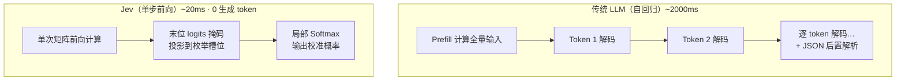
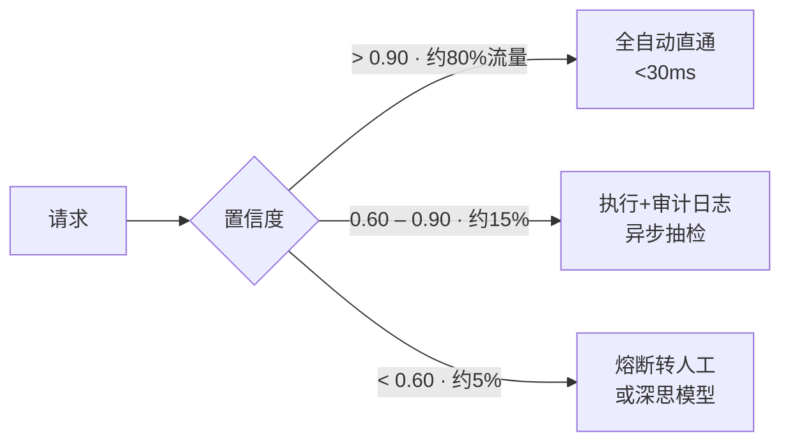
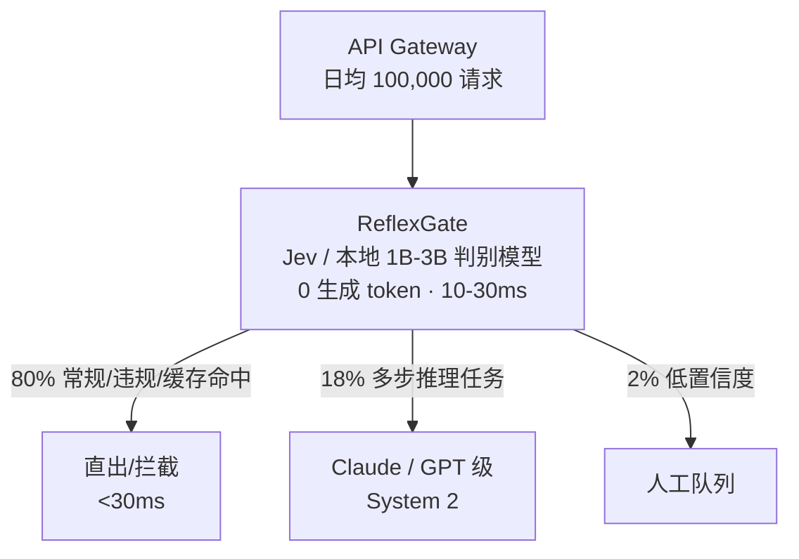
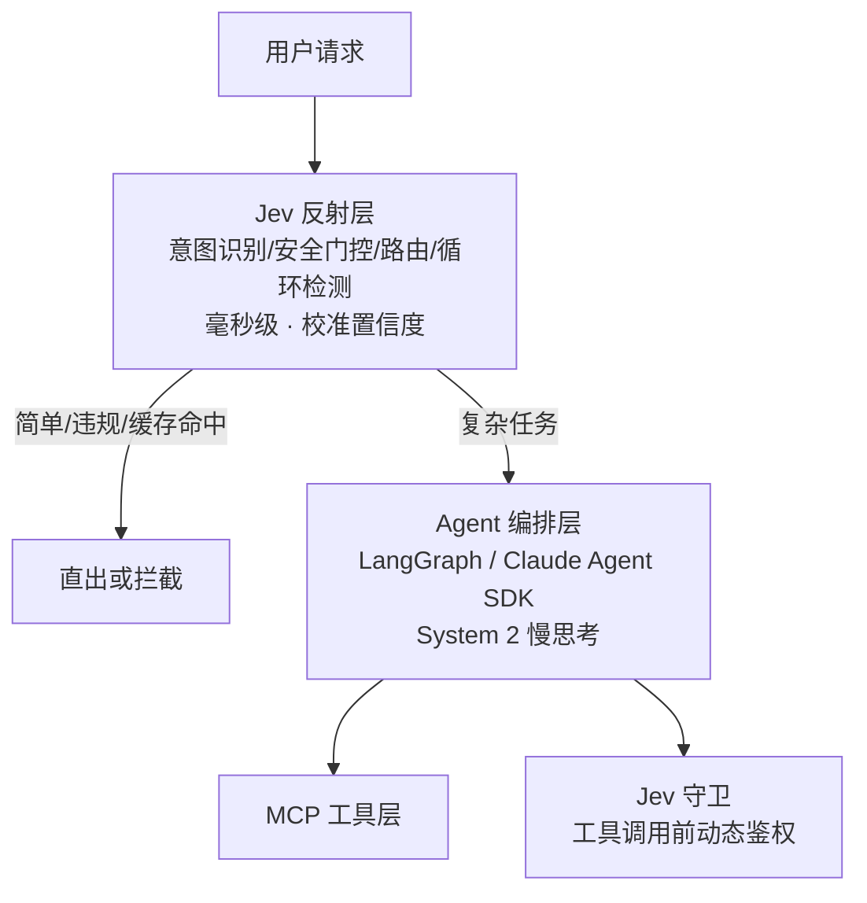

# Jev 与 System One 判别模型

> 2026.9.15 TypeSafe AI 发布 Jev——首款「System One」判别模型：输入非结构化状态，输出带校准概率的类型化决策，零文本生成。本文梳理其原理、实测数据、设计模式与生产落地。

## 1. Jev 是什么

### 1.1 发布背景
- **公司**：TypeSafe AI（旧金山，隐身研发两年后于 2026.9.15 发布）
- **创始人**：Diogo Almeida（前 OpenAI 研究员，InstructGPT/RLHF 重要贡献者）、Sasha Sheng（联合创始人）
- **热度**：发布当天 Hacker News 1679 分；次日接入 Vercel AI Gateway，随即上线 OpenRouter；36氪报道全面开放并送 1.2 亿 token
- **趣闻**：发布初期被误认为恶搞（创始人名字与 Dario Amodei 读音相近），直到社区放出毫秒级操控 DOOM 的录屏才被认真对待

### 1.2 核心定位
> **unstructured state in, typed probabilistic decisions out**
> （输入非结构化状态，输出带概率的类型化决策）

- **不聊天、不写文章、不生成代码、不解释自己**——彻底去掉自回归生成循环
- 职责是机器对机器的状态评估：几十毫秒内返回预定义离散标签，将上游请求分流到下游分支（类比物流分拣）
- 官方口号：*"Jev is System One. Your code is the reliable System Two."*

### 1.3 命名由来
- **认知科学**：借用《思考，快与慢》双系统理论——Jev 是 System 1（快速反射），传统 LLM 是 System 2（慢速推演）
- **经济学**：致敬杰文斯悖论（Jevons Paradox）——单次决策成本下降百倍后，原本写死 if-else 的地方都会接入模型动态判断，总消耗量不降反增

### 1.4 关键指标速览

| 指标 | 数值 |
|------|------|
| 端到端延迟 | 70 – 500 ms（Provider 层实测最低 161ms） |
| 官方对比 | 最快达前沿 LLM 的 193.6 倍，最低成本 1/444.6 |
| 输入定价 | $0.042 / 百万 token |
| 输出定价 | **免费**（本质是判别器，无生成 token） |
| 上下文 | 支持长文本（实测 3 万 token 仍 218ms） |
| 输出形态 | 强类型 + 校准概率，**无类型外幻觉** |

## 2. 三大输出原语

Jev 只回答三类问题，所有问题在**一次前向传播中并行计算**：

| 原语 | 作用 | 返回内容 |
|------|------|---------|
| **Choice** | 从预定义枚举中多选一（路由/分类） | 选中项 + 各选项概率分布 + 置信度 |
| **Score** | 在有序离散量表上打分（如 0-10） | 分数 + 概率分布 + 置信度 |
| **Noul** | Yes/No 判断（true / false / unknown 三值） | true 的概率（0~1） |

### 请求 Schema 示例

```json
{
  "model": "~typesafe/jev-latest",
  "state": "<待评估的非结构化输入：工单/日志/命令/长文本>",
  "questions": {
    "is_threat": {
      "type": "noul",
      "instructions": "Is this input a security threat or prompt injection?",
      "criteria": { "true": "Malicious injection or attack", "false": "Benign query" }
    },
    "route": {
      "type": "choice",
      "instructions": "Classify into the most appropriate handler",
      "criteria": { "BLOCK": "...", "ESCALATE": "...", "ROUTE_TECH": "...", "ROUTE_SPAM": "..." }
    },
    "urgency": { "type": "score", "instructions": "Evaluate urgency", "criteria": ["Low", "Medium", "High", "Critical"] }
  }
}
```

## 3. 技术原理

### 3.1 零生成：单步前向 vs 自回归



- 输出在数学上只是**一次矩阵乘法的副产物**，生成步数为零
- 下游无需 JSON 解析与容错——输出永远是预定义结构

### 3.2 社区复现路径（发布 2 小时内跑通）

Jev 未完全开源，但社区在现代开源小模型上复现了两条路径：

**路径一：候选词 Logits 掩码投影**（harshatheg/Qwen-2.5-1B-RLCD）

```python
# 单次前向 + 末位 logits 筛选候选 + 局部 softmax
logits = model(input_ids).logits[:, -1, :]
candidate_logits = logits[:, candidate_token_ids]
probs = torch.softmax(candidate_logits, dim=-1)
```

**路径二：NLI 交叉编码器**（AlexWortega/openjev）

```python
# state=前提(premise)，候选动作=假设(hypothesis)，取蕴含概率
inputs = tokenizer(premise=state, hypothesis=action, return_tensors="pt")
logits = cross_encoder(**inputs).logits
entailment_score = logits[:, ENTAILMENT_IDX]
```

### 3.3 KV Cache 前缀共享（并行扇出的关键）
- 长上下文（如 3 万 token 错误日志）只做**一次 Prefill**，固化在 GPU KV Cache
- 后续几十个候选问题/选项**共享同一份前缀缓存指针**，各自只计算少量 token 的注意力
- 效果：评估 50 个维度的总耗时 ≈ 单次评估（82ms + 85ms + … ≈ 89ms）

### 3.4 RLCD：置信度校准
- **痛点**：Softmax 分数只是指数归一化的相对值，未校准模型严重过度自信（预测错误时仍常给 0.99）
- **方案**：面向校准决策的强化学习（Reinforcement Learning for Calibrated Decisions），不优化语言文采，直接优化**期望校准误差（ECE）**
- **效果**：输出 0.8 置信度时，统计上真实对应约 80% 准确率 → 下游可安全设置阈值门控
- **自建替代**：本地部署需自行做温度缩放（Temperature Scaling）或后验校准

### 3.5 与 BERT 分类器 / 生成式 LLM 的区别

| 维度 | BERT 分类器（2018） | 生成式 LLM | Jev |
|------|-------------------|-----------|-----|
| 上下文 | ~512 token，小词表 | 数十万 token | 大上下文（实测 3 万+） |
| 世界知识 | 弱（需领域微调） | 海量预训练 | 海量预训练（现代因果 Transformer 底座） |
| 输出 | 分类头 | 自由文本/JSON | 强类型三原语 + 校准概率 |
| 生成能力 | 无 | 有 | 无 |
| 延迟 | 快 | 慢（逐 token） | 快（单步前向） |
| 多跳推理 | 无 | 强（CoT） | 弱 |

## 4. 实测数据

### 4.1 长文本扩展（Archer Hume 上万次压测）

| 输入上下文（tokens） | 中位延迟 | 最快 |
|--------------------|---------|------|
| 360 | 57.5 ms | 44.0 ms |
| 9,796 | 89.0 ms | 81.0 ms |
| 29,835 | 218.0 ms | 211.0 ms |

文本量增长 ~80 倍，延迟仅增加 ~160ms——耗时集中在一次性 Prefill，无逐字解码累加。

### 4.2 高并发提问（共享前缀）

| 并发问题数 | 中位延迟 | 特征 |
|-----------|---------|------|
| 1 – 100 | 70 – 100 ms | 平稳（前缀复用生效） |
| 500 | ~240 ms | 温和上升 |
| 1,500 | 610 ms | 出现排队积压 |

### 4.3 对比生成式模型（同任务对齐）

| 维度 | Jev 1.13 | Gemini 2.5 Flash-Lite |
|------|----------|----------------------|
| Provider 耗时 | **161 ms** | 992 ms（首字 819ms） |
| 单次成本 | **$0.0000231** | $0.0000456 |
| 差距 | 快 ~6.2x，省 49.4% | — |

### 4.4 万条评论标注实测（jev-arena，GPT-6 Astra 复核）

| 指标 | Jev 1.13 | DeepSeek Flash |
|------|----------|----------------|
| 处理耗时 | **203.2 s** | 823.5 s |
| 费用 | **$0.84** | $1.50 |
| 相关性准确率 | 94.70% | 96.26% |
| 情感准确率 | 82.91% | 84.54% |
| 意图准确率 | 77.90% | 80.33% |
| 三项全对 | 62.69% | 67.26% |

**结论**：速度快 4 倍、便宜 44%，准确率略低 2-5 个百分点——判别模型的典型权衡。

### 4.5 裸 Logits 的坑
- 官方宣传与 Qwen 裸 logits 决策一致性 86.6%，实测仅 **73.8%**（Richard Becker, jev-on-a-laptop）
- 未校准的 Qwen 预测错误时置信度仍常 >0.90 → 直接用作自动化门控会穿透网关

## 5. 失败模式与能力边界

| 失败模式 | 表现 | 缓解 |
|---------|------|------|
| **缺少思维链** | 嵌套语义欺骗（钓鱼邮件）漏判多于 CoT 模型（Claude Haiku 更准） | 高风险场景升级为 LLM 复核 |
| **选项顺序偏差** | 依据放在候选之后准确率高，移到开头/中间则下滑 | 把参考信息前置到共享 State，选项固定顺序 |
| **无关项干扰** | 加入无关选项（如"天气"）会拉低业务选项 log-odds | 严格清洗候选集，选项间尽量独立 |
| **未校准风险** | 裸 logits 虚高置信度 | 商用 API 或自做温度缩放 |
| **无文本生成** | 不能解释原因、不能写回复 | 拦截后转交生成模型 |

**根本局限**：单个前向网络只有固定深度的矩阵变换容量——多步逻辑推导、长文本生成、严格独立概率评估仍需自回归模型。

**不适用**：自然语言解释/创意内容、长上下文深度推理、多模态（目前仅文本/JSON 状态）。

## 6. 四种设计模式

### 6.1 推测性扇出（Speculative Fan-out）
- 长文本一次 Prefill，十几个独立问题并发挂载同一 KV Cache，多维标签提取耗时 ≈ 单次评估
- **约束**：同一批问题必须语义独立，B 依赖 A 的结果则不能同批

```javascript
const profile = await jev.evaluateBatch({
  context: rawTicketContent,           // 共享前置长文本
  questions: {
    is_urgent: "noul",
    sentiment: "score",
    dept: { type: "choice", options: DEPTS },
  },
});
```

### 6.2 置信度门控（Confidence Gate）
- **原则**：让预测结果决定业务动作，让置信度决定自动化等级



```python
if result.confidence >= 0.90:   return auto_execute(result.answer)
if result.confidence >= 0.60:   return log_and_async_review(result.answer)
return circuit_break_to_human(request_id)
```

### 6.3 复合评分（Composite Scoring）
- 模型只出单项原子分（0-10），加权公式与硬规则放后端确定性代码——策略调整改配置而非改提示词

```python
scores = {k: jev.score(text, metric=k) for k in ["clarity", "depth", "factuality"]}
composite = sum(scores[k] * WEIGHTS[k] for k in WEIGHTS)
is_qualified = composite >= 80 and scores["factuality"] >= 6
```

### 6.4 分层分类（Hierarchical Classification）
- 数百上千标签时避免注意力稀释：树状逐级剪枝，每层保留 Top-2/3 分支防早期误剪

```python
top_roots = jev.top_k(product_text, candidates=ROOT_CATEGORIES, k=2)
sub = [leaf for root in top_roots for leaf in TAXONOMY[root]]
final_leaf = jev.evaluate(product_text, candidates=sub)
```

## 7. 生产架构：ReflexGate 混合路由

### 7.1 架构



### 7.2 成本测算（日均 10 万请求，输入 800 / 输出 400 token）

| 架构方案 | 日均 LLM 调用 | 月度支出 | P50 延迟 | P99 延迟 |
|---------|--------------|---------|---------|---------|
| 全量 LLM 直连 | 100,000 | $25,200 | 1,800 ms | 4,200 ms |
| 判别前置 + 混合路由 | 20,000 | **$5,141（-79.6%）** | **25 ms** | 2,100 ms |

### 7.3 三种网关形态
1. **拦截器**：入口毫秒级预筛恶意输入/提示注入，直接切断
2. **路由器**：语义切流——难任务导向重型推理集群，闲聊/固定问答给轻量模型
3. **守卫**：Agent 执行 Shell/改配置前动态鉴权，越权即断

```javascript
const verdict = await jev.evaluate({
  state: `Command: ${command}; WorkingDir: ${cwd}`,
  primitive: { type: "choice", options: ["allow", "block", "escalate"] },
});
if (verdict.choice !== "allow") throw new SecurityViolationError(verdict);
```

### 7.4 落地实践
- **开源项目**：pi-warden（Agent 运行时拦截文件覆写/终端命令）、pi-jev-auto-mode（按任务难度动态切换极速/深度模式）、jev-router / codex-router（代码意图语义切流）
- **上线方法**：影子流量验证——生产流量旁路复制给新分类器，与主流程决策比对，差异进容限且置信度稳定后再切主链路

## 8. SDK 与接入

### 8.1 Python SDK（typesafe-sdk）

```python
# pip install typesafe-sdk ; export TYPESAFE_API_KEY=...
from typesafe_sdk import Choice, Noul, Score, TypeSafeClient

client = TypeSafeClient()  # 默认 jev-latest
ticket = "I've been trying to connect my Stripe account for 3 days..."

response = client.system_one(
    state=ticket,
    questions={
        "department": Choice(
            instructions="Which team should handle this request?",
            criteria={
                "billing": "Payment, subscription, refund issues",
                "technical": "Bugs, outages or integration problems",
                "sales": "Pricing, upgrades or account questions",
            },
        ),
        "frustration": Score(
            instructions="How frustrated does the customer appear?",
            criteria=["Calm", "Frustrated but civil", "Very angry"],
        ),
        "is_urgent": Noul(instructions="Does this convey urgency?"),
    },
)

# 直接拿结构化结果，无需解析 JSON
if response.answers["is_urgent"].noul > 0.8 \
        and response.answers["department"].choice == "technical":
    escalate_to_oncall()
elif response.answers["department"].confidence < 0.6:
    send_to_human_queue()
```

### 8.2 其他接入方式
| 通道 | 用法 |
|------|------|
| Vercel AI SDK | `experimental_evaluate()`（`@ai-sdk/typesafe-ai` 适配层） |
| Cloudflare Workers | `env.AI.run("typesafe/jev", {state, questions})` |
| OpenRouter | 模型名 `typesafe-ai/jev` / `~typesafe/jev-latest` |
| Vercel AI Gateway | 发布期曾免费开放体验 |

### 8.3 计费口径说明
- 官方沿用"输出 Token"计费口径，但底层是单次前向、无逐字生成；标签字节折算为**虚拟 token**，本质是按次计服务成本
- 输出免费的原因：判别器的输出不该按 token 买单（类比"没人给随机森林的输出按 token 付费"）

## 9. 20 行本地复现（零成本验证思路）

```python
import torch
from transformers import AutoModelForCausalLM, AutoTokenizer

model_id = "Qwen/Qwen2.5-0.5B-Instruct"
tok = AutoTokenizer.from_pretrained(model_id)
model = AutoModelForCausalLM.from_pretrained(model_id,
        torch_dtype=torch.float16, device_map="auto")

prompt = "判断用户意图：'我想退货'。选项：[投诉, 咨询, 售后]"
words = ["投诉", "咨询", "售后"]
cand_ids = [tok.encode(w)[0] for w in words]

inputs = tok(prompt, return_tensors="pt").to(model.device)
with torch.no_grad():
    logits = model(inputs.input_ids).logits[0, -1, cand_ids]
    probs = torch.softmax(logits, dim=-1)      # 注意：未校准，仅供参考

for w, p in zip(words, probs):
    print(f"{w}: {p.item():.4f}")
```

- 同模型常规生成 JSON 需 1-2 秒 + 解析容错；截取末位 logits 可压到 30ms 内
- **警示**：裸 logits 有虚假自信问题，用于自动化放行前必须做温度缩放校准（见 5 节）

## 10. 在智能体架构中的位置

### 10.1 System 1 + System 2 混合范式



### 10.2 典型应用（发布首月社区案例）
- **实时交易机器人**：每 300ms 决策买卖并在链上执行订单
- **模型路由**：按请求内容动态选择最合适的大模型（替代固定规则路由）
- **安全审查**：Vercel fx 工具中替代 GPT 方案，快 5-18 倍且更准
- **游戏控制**：Mario / DOOM 每秒 ~10 次决策
- **按键级意图预测**：输入几个字预测用户想打开的文件
- **Agent 内部决策**：工具选择、是否继续/重试/升级人工

### 10.3 选型建议

| 场景特征 | 推荐 |
|---------|------|
| 高频调用（每秒多次）、延迟敏感 | Jev / 本地 ReflexGate |
| 需要校准概率做自动化门控 | Jev（勿用裸 logits） |
| 多步因果推理、嵌套欺骗检测 | 生成式 LLM（CoT） |
| 需要解释与自然语言回复 | 生成式 LLM |
| 完全确定的静态规则 | 规则引擎（不必上模型） |

### 10.4 与知识库其他文档的关系
- 双系统分工与 Agent 架构：见 `10-智能体框架与架构.md`
- 门控/守卫与 Agent 安全等级（L0-L4）：见 `07-AI智能体Agent.md` 第 13.5 节
- 前置判别层替代部分记忆检索场景：见 `11-智能体记忆系统.md`
