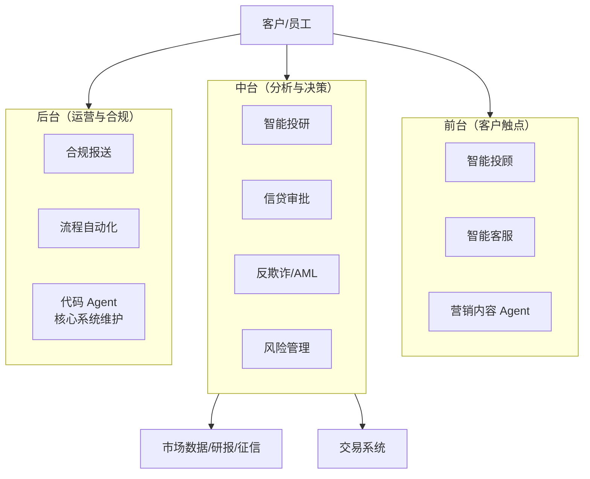

# 金融智能体专题

> 本文是 `02-金融AI.md`（传统金融 ML：评分卡/量化因子/反欺诈模型）的 Agent 化延伸：聚焦 2026 年智能体在金融行业的落地场景、架构模式、监管合规与实施路径。智能体基础技术见 `../03-大语言模型LLM/` 的 07/10/11/12 系列。

## 1. 金融行业为什么需要智能体

### 1.1 传统金融 AI 的局限
| 阶段 | 技术 | 局限 |
|------|------|------|
| 判别式模型（2015-2020） | 评分卡/XGBoost/规则引擎 | 只能单点预测，流程仍靠人工串联 |
| RPA + 对话机器人（2020-2023） | 脚本自动化/意图分类 | 路径写死，遇异常即断，无理解能力 |
| LLM 助手（2023-2025） | RAG 问答/摘要 | 只能"答"不能"做"，不触碰业务系统 |

### 1.2 智能体补齐的能力
- **多步骤任务编排**：把投研、审批、报送等多环节流程交给 Agent 自主规划执行
- **工具调用**：直连行情终端、研报库、交易系统、征信接口（MCP 标准化接入）
- **跨系统协同**：A2A 协议打通信贷、风控、合规等多个部门 Agent
- **自然语言交互**：客户经理/分析师用自然语言驱动复杂业务流程
- **实时决策**：System One 判别模型（Jev 类）承接高频毫秒级风控路由

### 1.3 2026 行业现状
- **国际**：摩根大通 LLM Suite 向全员推广、IndexGPT 布局智能投顾；Morgan Stanley 用 GPT 系辅助财富顾问；BloombergGPT 之后全面转向 Agentic 工作流
- **国内**：蚂蚁百灵/招行"AI 小招"/平安 AI 客服进入 Agent 化阶段；券商投研 Agent 成为标配试点
- **监管**：欧盟 AI 法案将信贷/保险定价列为高风险 AI；中国生成式 AI 管理办法落地；美联储 SR 11-7 模型风险管理框架扩展覆盖 LLM 应用；香港金管局、新加坡 MAS 均发布 GenAI 应用指引

## 2. 金融智能体应用全景



### 前中后台价值矩阵

| 层级 | 场景 | Agent 化收益 | 自治等级 |
|------|------|-------------|---------|
| 前台 | 智能投顾/客服/营销 | 响应秒级、7×24、个性化 | L1-L2（人审高） |
| 中台 | 投研/信贷/反欺诈/风控 | 分析效率 5-20 倍、实时拦截 | L2-L3（关键节点人审） |
| 后台 | 合规报送/运营/编码 | 人力节省 40-70% | L3-L4（审计追溯） |

## 3. 场景专题

### 3.1 智能投研 Agent（Deep Research 型）
- **痛点**：分析师每天阅读数十份研报/财报/新闻，信息过载，深度研究耗时数周
- **架构**：编排者-工作者（见 `10-智能体框架与架构.md` §4.1）
  - 编排 Agent（强推理模型）分解研究问题 → 并行检索 Worker（公告/研报/舆情/产业链）→ 冲突消解 → 综合成文（全程带引用）
- **工作流**：查询分解 → 多源并行检索 → 财报数据抽取（结构化）→ 逻辑链验证 → 生成带引用报告 → 分析师审阅
- **关键设计**：
  - 数字必须来自结构化数据源，LLM 只做组织与推理，禁止心算引用
  - 观点与事实分离标注；每条结论附证据链接
  - 交付物进研报库沉淀为组织记忆（见 `11-智能体记忆系统.md` §6.6）
- **效果**：深度专题从 2 周 → 2 天；日常晨报从 3 小时 → 10 分钟人审

### 3.2 智能投顾与财富管理
- **痛点**：长尾客户无人服务，人工顾问成本高且覆盖有限
- **架构**：对话式规划 Agent + 适当性管理守卫
  - 客户画像（KV 硬事实 + 向量偏好记忆）→ 目标/风险测评 → 资产配置建议 → **合规守卫 Agent 校验适当性** → 人工顾问复核（大额）
- **关键设计**：
  - **绝对禁止**：承诺收益、代客操作（先阶段）、推荐适当性外产品
  - 建议必须可追溯到规则引擎或白名单基金池，LLM 不直接生成标的
  - 对话记忆跨会话沉淀（风险偏好变化带时间线，支持"为什么当时推荐"审计）
- **监管红线**：投顾资质、适当性义务、信息披露——Agent 输出一律标注"辅助参考"

### 3.3 智能客服与渠道
- **痛点**：客服培训成本高、专业问题（额度/费率/外汇政策）解答口径不一
- **架构**：Swarm/Handoff 接力（分诊 → 账单/外汇/贷款专员 Agent）+ Jev 前置意图路由
  - Jev 毫秒级判别：意图分类 + 情绪评分 + 升级判断（noul）三原语并行
  - 高置信度直出；低置信度转人工；激愤客户强制升级（置信度门控，见 `12-Jev与SystemOne判别模型.md` §6.2）
- **关键设计**：知识库答案带版本与生效日期（监管口径变化即时失效旧答案）；全部会话留档可回溯
- **效果**：常见问题拦截率 70-85%，人工专注复杂与高价值对话

### 3.4 信贷审批 Agent
- **痛点**：小微/消费信贷件均审批成本高；材料核验（流水/发票/工商信息）人工繁琐
- **架构**：多 Agent 审查流水线 + 置信度门控
  ```
  材料收集 Agent（OCR+交叉核验）→ 征信/反欺诈查询 → 评分卡（传统 ML）
  → 审查 Agent（负面信息检索、疑点生成）→ 合规 Agent（监管禁入核查）
  → Jev 门控：高置信通过/拒绝自动出 → 灰区人工终审
  ```
- **关键设计**：
  - **评分仍用传统模型**（可解释、可验证）；Agent 负责材料核验、疑点解释、拒绝理由生成（对齐监管"拒绝必须给理由"）
  - 拒绝理由必须映射到具体规则/特征，禁止"综合评估不通过"类黑箱话术
  - 灰区比例（置信度 0.6-0.9）可调——业务淡季放宽人审范围，防自动误拒
- **效果**：件均审批时间从 2 天 → 30 分钟；人工只审 15-20% 灰区件

### 3.5 反欺诈与反洗钱（AML）
- **痛点**：规则引擎误报率高（人工排查 95%+ 是误报）；团伙欺诈隐蔽；电诈资金转移快
- **架构**：三层防御
  1. **实时层（毫秒）**：Jev 判别交易风险（noul 原语）+ 规则引擎 + 图特征——拦截高危、放行低危
  2. **分析层（分钟）**：图谱 Agent 做资金流追踪、团伙识别（多跳图推理，Zep/Graphiti 式时间线图）
  3. **调查层（小时）**：可疑案例 Agent 自动生成调查报告初稿 + 证据链，分析师终审
- **关键设计**：
  - 实时层用判别模型不用生成模型（延迟与稳定性）；拦截决策可校准（置信度→处置动作分级：放行/增强验证/挂起/冻结）
  - 可疑交易报告（STR）自动生成但必须人工签发（监管要求）
- **效果**：误报率降 50%+；案例调查从 4 小时 → 30 分钟初稿

### 3.6 合规与监管科技（RegTech）
- **痛点**：监管文件海量（新规发布后全行排查耗时数月）；报送口径频繁变化
- **架构**：
  - **政策监测 Agent**：订阅监管网站/公告 → 变更识别 → 影响面分析（哪些产品/条款/系统受影响）→ 分发整改任务
  - **监管报送 Agent**：口径知识库（监管文件 RAG）→ 数据映射核验 → 报送文件生成 → 人工复核签发
  - **交易监控 Agent**：员工通讯/交易行为合规扫描（荐股/内幕/异常交易模式）
- **关键设计**：监管文件解析准确率要求极高——采用双模型交叉验证 + 不确定处标注人工确认；报送文件版本化留痕

### 3.7 量化交易 Agent
- **痛点**：策略研发迭代慢；盘中信息（新闻/公告/资金流）无法实时融入决策
- **架构**：研究/执行分离的多 Agent 系统
  - **研究 Agent**（离线）：假设生成 → 因子挖掘（代码 Agent 写回测）→ 多策略辩论式验证
  - **实时决策**：毫秒级用 Jev/System One（社区已有每 300ms 决策的实盘案例）；低频调仓用规划 Agent
  - **风控守卫**：所有订单过 ReflexGate（见 §4），越权即断
- **关键设计**：
  - 交易 Agent 是**提示注入高危区**——新闻/舆情是外部输入，恶意构造的公告文本可操纵决策 → 外部信息只进判别特征/结构化抽取，不直接进生成式决策 prompt
  - 回测与实盘严格隔离；自动交易限额熔断；全量订单可回放审计
- **监管**：程序化交易报备义务（各国趋严），Agent 决策日志需满足可审计要求

### 3.8 风险管理与舆情监控
- **架构**：舆情 Agent（多源监控+情感评分 Jev score）→ 预警分级 → 风险报告 Agent 自动起草（压力测试情景描述、信用风险敞口汇总）
- **要点**：风险指标数值来自风控系统 API，Agent 只做叙述与归因分析；预警必须带时间戳与置信度

### 3.9 保险核保理赔 Agent
- **核保**：材料智能核验（体检报告/病历 OCR）→ 风险因子抽取 → 核保规则引擎 → 疑点 Agent 提问清单 → 核保师终审
- **理赔**：照片定损（多模态）→ 条款匹配 Agent（保单责任判定）→ 反欺诈筛查 → 小额自动赔付（置信度>0.95）/大额人工
- **效果**：小额案件自动赔付率 60-80%，理赔周期从天级到分钟级

### 3.10 银行内部运营与代码 Agent
- **IT 侧**：核心系统（大量 COBOL/遗留代码）维护——代码 Agent 理解遗留系统、生成迁移方案与测试；需求文档→接口代码初稿
- **流程侧**：RPA 升级为 Agent（例外处理能力）：对账、报表、公文流转，遇异常不再中断而是理解后分支处理
- **要点**：生产系统改动全走审计门禁（PreToolUse 钩子强制审批，见 `07-AI智能体Agent.md` Claude Agent SDK 生命周期钩子）

## 4. 架构模式复用（对应知识库 10/12 文档）

| 架构模式 | 金融场景 | 出处 |
|---------|---------|------|
| 编排者-工作者 | 智能投研、尽调 | `10` §4.1 |
| 顺序流水线 + 人工卡点 | 信贷审批、监管报送 | `10` §4.3 |
| 并行 Map-Reduce | 多源舆情、组合风控扫描 | `10` §4.4 |
| 辩论/投票 | 投资观点交叉验证 | `10` §4.5 |
| Swarm/Handoff | 客服路由 | `10` §4.6 |
| 置信度门控 | 信贷灰区、自动理赔、反欺诈处置 | `12` §6.2 |
| ReflexGate 前置拦截 | 交易风控、渠道入口防注入 | `12` §7 |
| 分层分类 | 交易分类/科目映射 | `12` §6.4 |
| 客户 360 记忆 | 投顾/客服个性化 | `11` §6.1-6.2 |
| 组织记忆（GraphRAG+ACL） | 投研库、合规知识库 | `11` §6.7 |

## 5. 监管合规与安全（金融特有）

### 5.1 监管框架要点
| 框架 | 对金融 Agent 的核心要求 |
|------|------------------------|
| 欧盟 AI 法案 | 信贷/保险定价属高风险 AI：数据治理、日志留存、人工监督、透明度义务 |
| 美国 SR 11-7 | 模型验证、独立评审、持续监控——LLM 应用纳入模型风险管理范围 |
| 中国生成式 AI 管理办法 | 备案、内容安全评估、生成内容标识 |
| MAS/HKMA 指引 | 问责制（董事会兜底）、公平性、可解释性、第三方风险管理 |

### 5.2 金融 Agent 特有风险与对策
| 风险 | 场景 | 对策 |
|------|------|------|
| 幻觉数字 | 研报/风控报告 | 数字一律来自数据 API；引用强制溯源 |
| 提示注入 | 交易 Agent 读新闻/公告 | 外部文本→结构化抽取后再用；输入消毒 |
| 越权操作 | 代客交易/改核心系统 | 工具最小权限 + 高危操作人审门禁 |
| 口径过期 | 客服/合规答复 | 知识库带生效日期，过期自动失效 |
| 拒绝解释 | 信贷/保险拒批 | 理由映射规则库，禁黑箱话术 |
| 数据出域 | 全场景 | 私有化部署/金融云专区；客户数据脱敏 |

### 5.3 自治分级落地（对齐 `07` §13.5）
- **L1-L2（客户触点）**：建议生成 + 强制人审，Agent 不碰资金操作
- **L2-L3（中台风控）**：高置信自动 + 灰区人审 + 全量审计
- **L3-L4（后台运营）**：事务性操作自动化，异常升级人工，回放可审计

## 6. 代码示例

### 6.1 信贷审批多 Agent 流水线（LangGraph 风格骨架）

```python
from typing import TypedDict

class CreditState(TypedDict):
    application: dict        # 申请材料
    verified: dict           # 材料核验结果
    score: float             # 传统评分卡分数
    issues: list             # 疑点清单
    compliance_ok: bool
    decision: str            # approve / reject / manual_review
    reason_codes: list       # 拒绝理由码（监管要求）

def verify_docs(state: CreditState):
    """材料核验 Agent：OCR + 交叉核验（流水 vs 收入声明 vs 社保）"""
    return {"verified": doc_agent.cross_check(state["application"])}

def score_application(state: CreditState):
    """传统评分卡（XGBoost）——可解释、已验证，不被 LLM 替代"""
    return {"score": scorecard.predict(state["verified"])}

def find_issues(state: CreditState):
    """审查 Agent：负面信息检索 + 疑点生成（工商诉讼/舆情/多头借贷）"""
    return {"issues": risk_agent.search_negative(state["application"]["company"])}

def compliance_check(state: CreditState):
    """合规 Agent：监管禁入名单/行业限制核查"""
    return {"compliance_ok": compliance_agent.screen(state["application"])}

def gate_with_confidence(state: CreditState):
    """Jev 置信度门控：高置信自动决策，灰区转人工"""
    verdict = jev.system_one(
        state=render_case_summary(state),
        questions={
            "decision": Choice(instructions="Final credit decision",
                criteria={"approve": "Low risk, docs verified",
                          "reject": "Hard rule hit or fraud signal",
                          "manual_review": "Gray zone"}),
            "reason": Choice(instructions="Primary reason code",
                criteria=REASON_CODE_BOOK),   # 理由必须映射规则码
        })
    if verdict.answers["decision"].confidence < 0.9:
        return {"decision": "manual_review"}
    return {"decision": verdict.answers["decision"].choice,
            "reason_codes": [verdict.answers["reason"].choice]}

workflow = pipe(verify_docs, score_application, find_issues,
                compliance_check, gate_with_confidence)  # 顺序流水线+人审卡点
```

### 6.2 反欺诈实时拦截（Jev 前置门控）

```python
def transaction_gate(tx: dict) -> str:
    """毫秒级三层处置：放行/增强验证/挂起。生成式 LLM 不参与实时路径。"""
    verdict = jev.system_one(
        state=f"payer={tx['payer']} payee={tx['payee']} amount={tx['amount']} "
              f"time={tx['time']} device={tx['device']} history={tx['recent_pattern']}",
        questions={
            "is_fraud": Noul(instructions="High-risk or anomalous transaction?"),
            "channel_risk": Score(instructions="Fraud pattern match level",
                                  criteria=["Normal", "Suspicious", "Highly suspicious"]),
        })
    p = verdict.answers["is_fraud"].noul
    if p > 0.90:  return "HOLD"        # 高危挂起
    if p > 0.60:  return "STEP_UP"     # 增强验证（人脸/短信）
    return "PASS"                      # 放行
```

### 6.3 投研 Agent 的防幻觉引用结构

```python
def research_report(question: str) -> dict:
    """编排者-工作者：数字走数据 API，LLM 只组织与推理"""
    sub_queries = orchestrator.decompose(question)
    findings = []
    for sq in sub_queries:                      # 并行检索 worker
        evidence = search_worker(sq)             # 公告/研报/行情
        for e in evidence:
            findings.append({
                "claim": extract_claim(e),        # 单一事实断言
                "value": e.numeric_value,         # 数字来自 API 字段
                "source": e.source_url,           # 强制溯源
                "as_of": e.timestamp,             # 时点标注
            })
    return synthesizer.write(question, findings)  # 结论逐条挂引用
```

## 7. 实施路径与挑战

### 7.1 分阶段路线
1. **知识助手（0-6 月）**：RAG 问答、文档摘要——低风险，建立信任与数据基建
2. **流程自动化（6-18 月）**：人机回环 Agent 承接材料核验、报告起草、报送初稿
3. **半自治 Agent（18 月+）**：置信度门控下的自动决策 + 全链路审计

### 7.2 主要挑战
| 挑战 | 现状与对策 |
|------|-----------|
| 幻觉零容忍 | 数字/结论与生成分离；引用溯源；灰区人审 |
| 数据敏感 | 金融云/私有化部署；国产开源模型（Qwen/GLM/DeepSeek）主流 |
| 遗留系统 | MCP 网关封装核心系统接口；代码 Agent 辅助 COBOL 理解 |
| 模型验证 | SR 11-7 式验证流程扩展到 Agent（轨迹评估+回归测试） |
| 成本 | 模型分级（编排用前沿、判别用 Jev/小模型）；非必要不上多 Agent |
| 组织 | "AI 员工"岗位职责重定义；人审团队技能转型 |

### 7.3 效果基线（2026 行业公开数据口径）
- 投研深度报告：效率 5-20 倍（人审保留）
- 客服拦截率：70-85%
- 信贷件均审批：天级 → 分钟级（人工仅灰区）
- 反欺诈误报：降 50%+
- 后台流程自动化：人力节省 40-70%

## 8. 相关文档
- 智能体基础与协议：`../03-大语言模型LLM/07-AI智能体Agent.md`
- 框架与架构模式：`../03-大语言模型LLM/10-智能体框架与架构.md`
- 记忆系统（客户画像/组织记忆）：`../03-大语言模型LLM/11-智能体记忆系统.md`
- System One 判别与置信度门控：`../03-大语言模型LLM/12-Jev与SystemOne判别模型.md`
- 传统金融 ML（评分卡/量化/反欺诈模型）：`02-金融AI.md`
