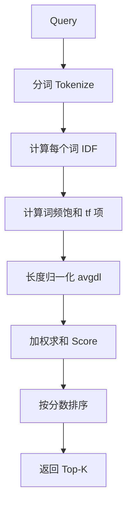
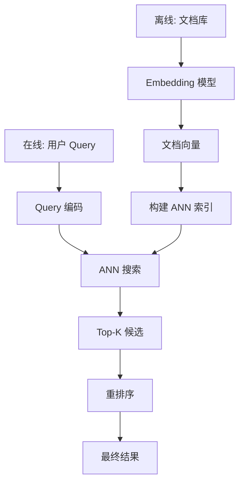

# 文本搜索

## 1. 核心概念

文本搜索根据用户 Query 在海量文本中找到最相关内容，是智能搜索最基础的形态。按技术路线分为三档：

| 路线 | 原理 | 代表作 | 优点 | 缺点 |
|------|------|--------|------|------|
| 关键词检索 | 字面匹配 + 词频统计 | BM25 / Lucene / ES | 快、透明、零训练 | 无语义，同义改写失效 |
| 语义检索 | 向量化 + ANN | BGE / SBERT + FAISS | 理解语义、召回高 | 依赖嵌入质量、冷启动 |
| 混合检索 | 二者融合 + 重排序 | BM25 + RRF + re-rank | 兼顾精确与语义 | 工程复杂、延迟增加 |

## 2. 常见场景

| 场景 | 输入 | 输出 | 关键要求 |
|------|------|------|---------|
| 电商商品搜索 | "高性价比跑步鞋" | 商品列表 | 同义词、属性匹配 |
| 代码搜索 | "如何连接数据库" | 代码片段 | 语义 + 语法权重 |
| 企业内部知识库 | "报销流程" | 文档片段 | 权限过滤 + 精准 |
| 论文/文献检索 | "Transformer attention" | 论文 | 术语 + 引文 |
| 日志/异常检索 | 错误关键词 | 日志行 | 毫秒级 + 高吞吐 |
| 客户服务 FAQ | 用户口语问题 | 标准答案 | 口语归一化 |

## 3. 算法详细介绍

### 3.1 TF-IDF

词频-逆文档频率，衡量词在文档中的重要性。

```
TF(t,d) = 词t在文档d中出现次数 / 文档d总词数
IDF(t)  = log( 总文档数N / 包含词t的文档数df(t) )
Score   = TF(t,d) * IDF(t)
```

| 特性 | 优点 | 缺点 |
|------|------|------|
| 实现 | 简单，无需训练 | 词序信息完全丢失 |
| 词权 | 高频词降权合理 | 短文档 IDF 偏高 |
| 扩展 | 可加词性、位置加权 | 无语义、拼写敏感 |

### 3.2 BM25（Okapi）

Lucene/ES 默认算法，在 TF-IDF 上引入词频饱和与文档长度归一化。

```
Score(D,Q) = Σ IDF(qi) * [tf(qi,D) * (k1+1)] / [tf(qi,D) + k1 * (1 - b + b * |D|/avgdl)]

IDF(qi) = ln( (N - df(qi) + 0.5) / (df(qi) + 0.5) + 1 )
k1 ≈ 1.2-2.0（词频饱和），b ≈ 0.75（长度归一化）
```



**对比 TF-IDF vs BM25：**

| 维度 | TF-IDF | BM25 |
|------|--------|------|
| 词频处理 | 线性增长 | 饱和（非线性） |
| 长文档惩罚 | 无 | 有（avgdl 归一化） |
| 关键参数 | 无 | k1, b |
| 检索效果 | 基线 | 普遍更优 5-15% |
| 复杂度 | O(N·len) | O(N·len) |

### 3.3 语义向量检索

将 Query 与文档编码到同一语义空间，用 ANN 召回。



**嵌入模型对比：**

| 模型 | 维度 | 语言 | 最大长度 | 特点 |
|------|------|------|---------|------|
| text-embedding-3-small | 1536 | 多语言 | 8192 | 官方 API |
| BGE-large-zh-v1.5 | 1024 | 中文 | 512 | 中文最强之一 |
| bge-m3 | 1024 | 多语言 | 8192 | 稀疏+稠密+多向量 |
| E5-mistral-7b | 4096 | 英文 | 4096 | 大模型高精度 |
| GTE-Qwen2-7B | 3584 | 中文 | 32768 | 长文档 |
| jina-embeddings-v3 | 1024 | 多语言 | 8192 | 支持 Matryoshka 截断 |

### 3.4 混合检索与融合

**RRF（Reciprocal Rank Fusion）：**

```
RRF_score(D) = Σ_r 1 / (k + rank_r(D))   k=60
```

| 融合方法 | 原理 | 优点 | 缺点 |
|---------|------|------|------|
| 线性加权 | α*BM25 + (1-α)*向量 | 简单、可调 | 分数分布不一致 |
| RRF | 基于排名而非分数 | 免调参、鲁棒 | 忽略分数信息 |
| 学习排序 LTR | 训练模型融合 | 效果最优 | 需标注、有偏 |
| ColBERT 后期交互 | 词级 token 交互 | 精度高 | 计算量大 |

**ColBERT（MaxSim 后期交互）：**

```
Score(q, d) = Σ_i max_j <q_i, d_j>      # 每个 query token 找最相似 doc token
```

```python
# 混合检索完整实现
from rank_bm25 import BM25Okapi
import numpy as np

class HybridSearcher:
    def __init__(self, docs, embeddings, k1=1.5, b=0.75, k=60):
        self.docs = docs
        self.embeddings = embeddings
        tokenized = [d.split() for d in docs]
        self.bm25 = BM25Okapi(tokenized, k1=k1, b=b)
        self.k = k

    def _bm25_top(self, query, top_k):
        scores = self.bm25.get_scores(query.split())
        return np.argsort(scores)[::-1][:top_k]

    def _vector_top(self, query_vec, top_k):
        scores = self.embeddings @ query_vec
        return np.argsort(scores)[::-1][:top_k]

    def rrf_search(self, query, query_vec, top_k=10):
        from collections import Counter
        rank = Counter()
        bm_top = self._bm25_top(query, top_k * 2)
        vec_top = self._vector_top(query_vec, top_k * 2)
        for pos, idx in enumerate(bm_top):
            rank[idx] += 1.0 / (self.k + pos + 1)
        for pos, idx in enumerate(vec_top):
            rank[idx] += 1.0 / (self.k + pos + 1)
        return rank.most_common(top_k)
```

### 3.5 重排序（Re-ranking）

召回阶段追求召回率，精排阶段追求精度。常用三类重排器：

| 重排器 | 类型 | 输入 | 精度 | 成本 |
|--------|------|------|------|------|
| Cross-Encoder (bge-reranker) | 双塔交互 | Query+Doc 拼接 | 高 | 高 |
| Cohere Rerank | API | Query+Docs | 高 | 商业化 |
| 交叉注意力 LLM | 生成式 | Prompt 打分 | 最高 | 最高 |
| ColBERT | 后期交互 | token 级 | 中高 | 中 |

```python
# Cross-Encoder 重排序
from sentence_transformers import CrossEncoder

model = CrossEncoder("BAAI/bge-reranker-base")

def rerank(query, candidates, top_k=5):
    pairs = [(query, doc) for doc in candidates]
    scores = model.predict(pairs)
    ranked = sorted(zip(candidates, scores), key=lambda x: x[1], reverse=True)
    return ranked[:top_k]
```

## 4. 工程化实现

### 4.1 Elasticsearch 全文检索

```python
# ES 客户端
from elasticsearch import Elasticsearch

es = Elasticsearch("http://localhost:9200")

# 创建带中文 IK 分词的索引
es.indices.create(index="docs", mappings={
    "properties": {
        "content": {"type": "text", "analyzer": "ik_max_word"},
        "title": {"type": "text", "analyzer": "ik_smart"},
        "category": {"type": "keyword"},
        "created": {"type": "date"}
    }
})

# BM25 检索 + 过滤 + 高亮
resp = es.search(index="docs", query={
    "bool": {
        "must": [{"match": {"content": "报销 流程"}}],
        "filter": [{"term": {"category": "hr"}}]
    }
}, highlight={"fields": {"content": {}}}, size=10)
```

### 4.2 向量语义检索（FAISS）

```python
import faiss
import numpy as np

d = 1024  # bge 模型维度

# 归一化 + 内积 = 余弦相似度
def build_index(vectors):
    index = faiss.IndexFlatIP(d)
    faiss.normalize_L2(vectors)
    index.add(vectors)
    return index

index = build_index(doc_vectors)

# HNSW 加速
hnsw = faiss.IndexHNSWFlat(d, M=16)
faiss.normalize_L2(doc_vectors)
hnsw.add(doc_vectors)
hnsw.hnsw.efSearch = 128

query_vec = query_embedding.reshape(1, -1)
faiss.normalize_L2(query_vec)
scores, ids = hnsw.search(query_vec, 10)
```

## 5. 对比优劣总结

| 方案 | 召回质量 | 延迟 | 部署成本 | 维护成本 | 适用规模 |
|------|---------|------|---------|---------|---------|
| ES 纯 BM25 | 中 | 10-50ms | 中 | 中 | 亿级 |
| 纯向量检索 | 高(语义) | 1-10ms | 低-中 | 低 | 千万-亿 |
| ES + 向量混合 | 最高 | 20-80ms | 中-高 | 中-高 | 亿级 |
| Milvus/Qdrant 混合 | 最高 | 10-50ms | 中-高 | 中 | 十亿级 |
| Chroma | 中 | 1-10ms | 极低 | 低 | 百万级 |

## 6. 2025-2026 趋势

- **GraphRAG 检索**：图谱增强召回，跨实体推理
- **上下文嵌入**：Contextual Embeddings，避免歧义
- **长文档检索**：GTE-Qwen 等 32K 上下文嵌入模型
- **Agentic 检索**：Agent 自主规划多轮检索
- **流式索引**：增量更新无需重建
- **评测基准**：MTEB / BEIR 持续扩展多语言与多模态
