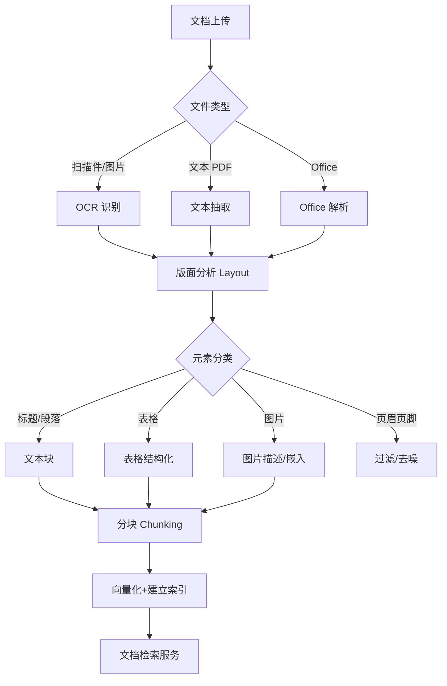
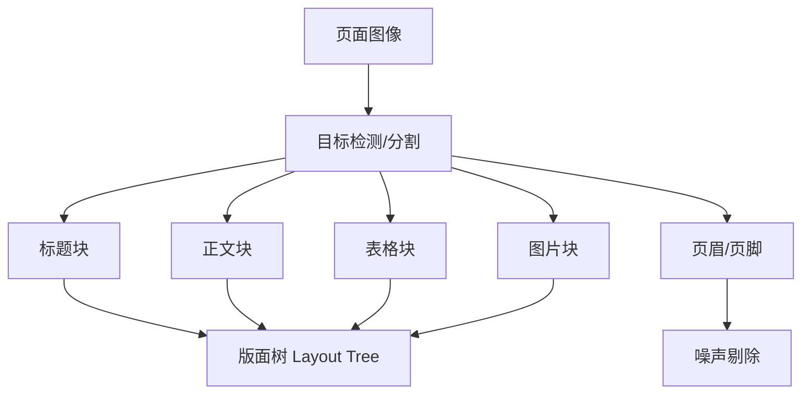

# 文档搜索

## 1. 核心概念

文档搜索面向 PDF、Word、Excel、PPT、扫描件等富格式文档，需要在文本之上融合**版面结构**（标题层级、段落、表格、图片）与**视觉信息**（扫描图、图表），是知识库与企业检索的主体。

| 文档类型 | 结构复杂度 | 难点 | 典型场景 |
|---------|-----------|------|---------|
| Word/PDF 文本型 | 中 | 标题层级、表格、页眉页脚 | 合同、报告 |
| 扫描版 PDF | 高 | OCR、版面还原 | 纸质档案 |
| Excel | 高 | 行列语义、公式、Sheet | 财务报表 |
| PPT | 高 | 页面主题、图形文字 | 方案、课件 |
| 论文 | 中 | 公式、引文、图表 | 科研 |

## 2. 常见场景

| 场景 | 输入 | 输出 | 关键要求 |
|------|------|------|---------|
| 合同智能检索 | "违约金条款" | 条款原文+页码 | 版面还原、精确引用 |
| 论文查证 | 研究主题 | 相关段落 | 公式、图表、引文 |
| 财报问答 | "今年毛利率" | 表格数值+上下文 | 表格结构化 |
| 法规检索 | 关键词 | 法条+出处 | 版本、效力 |
| 产品手册 | 故障描述 | 操作步骤 | 图文对应 |

## 3. 文档解析管道



## 4. 算法详细介绍

### 4.1 OCR 技术

| 方案 | 类型 | 语言 | 精度 | 速度 | 成本 |
|------|------|------|------|------|------|
| Tesseract | 传统 | 100+ | 中 | 中 | 免费 |
| PaddleOCR | 传统+DL | 中英多语言 | 高 | 快 | 免费开源 |
| ABBYY | 商业 | 200+ | 最高 | 中 | 昂贵 |
| 大模型 VL (Qwen-VL) | 多模态 | 多语言 | 高 | 慢 | API |

```python
# PaddleOCR 快速接入
from paddleocr import PaddleOCR

ocr = PaddleOCR(use_angle_cls=True, lang="ch")

result = ocr.ocr("scan.pdf", cls=True)
for line in result[0]:
    box, (text, score) = line
    print(text, round(score, 3))
```

### 4.2 版面分析（Layout Analysis）

将页面划分为文本块、标题、表格、图片等区域，是文档结构化的核心。



| 模型 | 类型 | 版面类别 | 特点 |
|------|------|---------|------|
| LayoutLMv3 | Transformer | 多类别 | 文本+布局融合预训练 |
| DETR | 端到端检测 | 可配置 | 免 NMS |
| PaddleOCR PP-Structure | 流水线 | 表格/文字/图片 | 工程化完整 |
| DocLayout-YOLO | YOLO | 文档版面 | 中文文档专项 |

### 4.3 文档分块（Chunking）

分块策略直接影响检索质量：

| 策略 | 优点 | 缺点 | 适用 |
|------|------|------|------|
| 固定长度 (256-512 token) | 简单均匀 | 切断语义 | 通用 |
| 段落/标题层级 | 结构完整 | 块大小不均 | 报告、合同 |
| 语义分割 (Embedding 相似度) | 语义连贯 | 计算成本高 | 长文档 |
| 递归字符分割 | 长度可控 | 边界粗糙 | LangChain 默认 |

```python
# 层级感知分块（按标题切分）
import re

def hierarchical_chunk(text, max_len=800):
    chunks, current, title = [], [], None
    for line in text.split("\n"):
        if re.match(r"^#{1,3}\s", line):      # 标题行
            if current:
                chunks.append((title, "\n".join(current)))
                current = []
            title = line.strip("# ").strip()
        else:
            current.append(line)
            if sum(len(c) for c in current) >= max_len:
                chunks.append((title, "\n".join(current)))
                current = []
    if current:
        chunks.append((title, "\n".join(current)))
    return chunks
```

### 4.4 表格结构化检索

```python
# Camelot 抽取 PDF 表格
import camelot

tables = camelot.read_pdf("financial.pdf", pages="1-3", flavor="lattice")
for table in tables:
    df = table.df
    table.to_csv(f"table_{table.page}.csv")
```

### 4.5 文档嵌入与检索

文档级搜索常结合三种粒度：**页面级**（定位页码）、**块级**（语义召回）、**段落级**（引用溯源）。

| 粒度 | 索引单元 | 检索用途 | 引用能力 |
|------|---------|---------|---------|
| 页面 | 整页 | 快速定位 | 页码 |
| 块 (256-512 token) | 语义块 | 高质量召回 | 块 id |
| 段落 | 自然段落 | 精确引用 | 段落+页码 |

## 5. 工程化实现：企业文档检索系统

```python
# 完整文档检索管道（PDF → 索引 → 检索）
import hashlib
from unstructured.partition.pdf import partition_pdf

def ingest_pdf(path):
    elements = partition_pdf(
        filename=path,
        strategy="hi_res",          # 高精度含 OCR + 版面
        infer_table_structure=True,
    )
    docs = []
    for el in elements:
        text = str(el)
        if not text.strip():
            continue
        meta = {
            "type": type(el).__name__,          # Title/Table/Text/Image
            "page": el.metadata.page_number,
            "doc": path,
            "hash": hashlib.md5(text.encode()).hexdigest(),
        }
        docs.append({"text": text, "meta": meta})
    return docs

# 检索时混合: 关键词(元数据/类型过滤) + 向量(内容)
def search_doc(query, index, doc_ids, top_k=10):
    # 1. 向量召回
    qv = embed(query)
    hits = index.search(qv, top_k * 2)
    # 2. 按元数据过滤 (文档范围/类型)
    hits = [h for h in hits if h.meta["doc"] in doc_ids]
    # 3. 按页码聚合，保证引用完整性
    return aggregate_by_page(hits)
```

## 6. 对比优劣总结

| 方案 | 文本型文档 | 扫描件 | 表格 | 版面 | 成本 |
|------|-----------|--------|------|------|------|
| 纯文本抽取 (pypdf) | 优 | 无效 | 差 | 无 | 低 |
| Unstructured 库 | 优 | 中 | 中 | 中 | 低 |
| PyMuPDF + LayoutLMv3 | 优 | 中 | 中 | 高 | 中 |
| PaddleOCR 全流程 | 优 | 优 | 高 | 高 | 中 |
| 商业 (腾讯/百度智图) | 优 | 优 | 高 | 高 | 高 |

## 7. 2025-2026 趋势

- **多模态文档模型**：文本+版面+图像统一编码（PDF-to-Vector）
- **Layout 感知 RAG**：检索时保留标题层级与表格结构
- **增量解析**：只解析变更页，增量更新索引
- **文档图谱**：实体抽取构建文档间关联
- **端到端文档理解**：大模型直接读版面（GPT-4o/Claude 文档能力）
