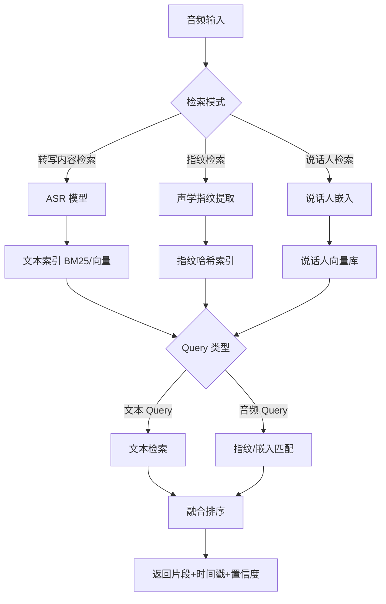
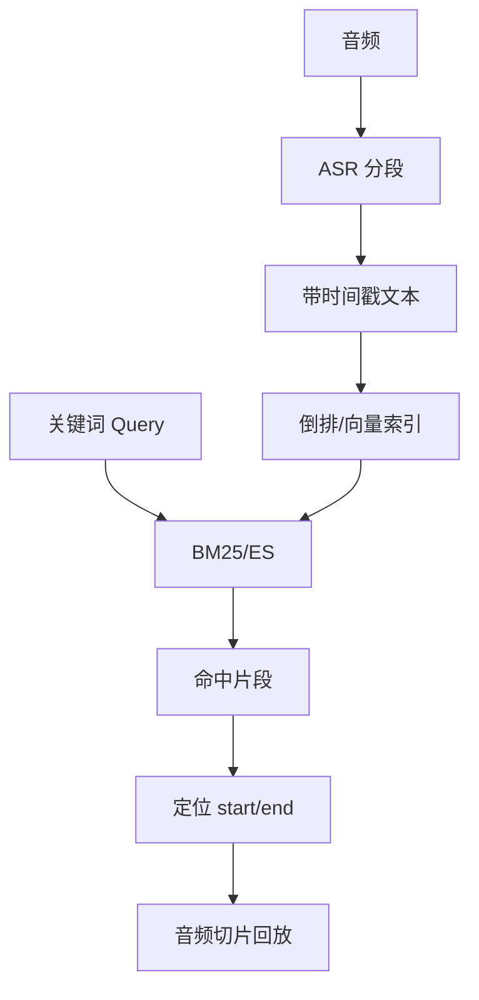
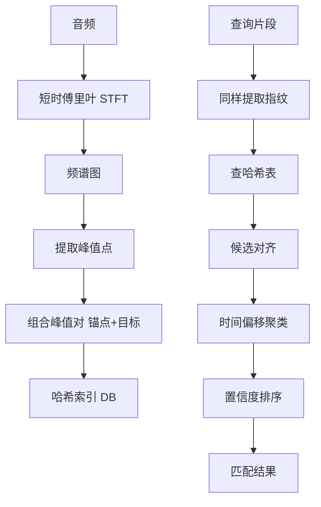

# 语音搜索

## 1. 核心概念

语音搜索将音频信号转化为可检索的信息。按检索目标分为两类：**内容检索**（音频里"说了什么"）与**身份/声音检索**（音频里"谁在说"、是否同一段音频）。语音搜索广泛应用于客服质检、语音助手、音频版权检测、声纹认证。

| 检索类型 | 目标 | 核心技术 | 代表场景 |
|---------|------|---------|---------|
| ASR 转写检索 | 说了什么 | Whisper / SenseVoice | 客服质检、会议纪要 |
| 语音指纹检索 | 是哪段音频 | 声学指纹 (Shazam) | 版权、重复音频检测 |
| 说话人检索 | 谁在说话 | 说话人嵌入 | 身份认证、日志检索 |
| 关键词唤醒 | 是否包含某词 | 热词偏置 | 语音助手 |

## 2. 常见场景

| 场景 | 输入 | 输出 | 关键要求 |
|------|------|------|---------|
| 客服通话质检 | "退款失败" | 通话片段+时间戳 | 口语、噪声鲁棒 |
| 会议纪要搜索 | "预算讨论" | 相关发言段落 | 多人分离 |
| 语音助手 | 口述指令 | 意图+槽位 | 低延迟、热词 |
| 音乐识别 | 哼唱片段 | 匹配歌曲 | 指纹鲁棒 |
| 声纹认证 | 实时语音 | 身份匹配 | 防伪造 |
| 音视频库检索 | 语音内容关键词 | 音视频段落 | 大规模索引 |

## 3. 语音搜索架构



## 4. 算法详细介绍

### 4.1 ASR 转写（内容检索基础）

| 模型 | 参数量 | 语言 | 实时率 | 特点 |
|------|--------|------|--------|------|
| Whisper large-v3 | 1550M | 99 语种 | ~0.5 | 泛化强、标点完整 |
| Whisper small | 244M | 多语种 | ~0.3 | 端侧可用 |
| SenseVoice | 2B | 中英日韩 | 极快 | 中文专项、情绪识别 |
| FunASR (Paraformer) | 220M | 中文 | 0.1 | 工业级中文 |
| K2/Kaldi | 定制 | 多语 | 0.1 | 可定制词典 |

```python
# Whisper 转写 + 热词
import whisper

model = whisper.load_model("small")

# 热词提示（提高业务词汇命中）
result = model.transcribe(
    "call.wav",
    initial_prompt="退款, 售后, 物流, 客服",
    language="zh",
)
for seg in result["segments"]:
    print(seg["start"], seg["end"], seg["text"])
```

### 4.2 转写内容检索

转写结果带**时间戳**，检索返回时可直接跳转到音频对应位置。



```python
# 检索命中 → 音频切片
def slice_audio(audio_path, start, end, out_path):
    import librosa, soundfile as sf
    y, sr = librosa.load(audio_path, sr=16000)
    sf.write(out_path, y[int(start*sr):int(end*sr)], sr)
```

### 4.3 语音指纹（Shazam 算法）

声学指纹把音频转换为"频谱峰值指纹"，用哈希做快速匹配，对噪声、变速鲁棒。



| 特性 | 优点 | 缺点 |
|------|------|------|
| 鲁棒性 | 抗噪声、抗变速/变调 | 无法检索语义内容 |
| 速度 | 哈希 O(1) 查询 | 片段过短(<2s)失效 |
| 规模 | 百万级曲库 | 需处理重叠峰值 |

### 4.4 说话人嵌入（声纹）

用 DNN 将任意时长语音映射为固定维度向量，向量距离代表声音相似度。

| 模型 | 输入 | 维度 | 特点 |
|------|------|------|------|
| ECAPA-TDNN | 音频特征 | 192 | 当前 SOTA 之一 |
| X-vector (Kaldi) | 帧级特征 | 512 | 经典、稳定 |
| CAM++ | 音频 | 192 | 中文场景好 |
| ResNet-based | 频谱图 | 512 | 灵活 |

```python
# ECAPA-TDNN 说话人嵌入
import torch
from speechbrain.inference.speaker import EncoderClassifier

classifier = EncoderClassifier.from_hparams(
    source="speechbrain/spkrec-ecapa-voxceleb",
    savedir="tmp_model",
)

def embed_speaker(audio_path):
    signal = classifier.load_audio(audio_path)
    emb = classifier.encode_batch(signal)          # (1, 1, 192)
    emb = torch.nn.functional.normalize(emb.squeeze(), dim=0)
    return emb

def verify(audio1, audio2, threshold=0.45):
    e1, e2 = embed_speaker(audio1), embed_speaker(audio2)
    score = torch.cosine_similarity(e1, e2, dim=0)
    return float(score) > threshold, float(score)
```

### 4.5 热词偏置与端到端检索

| 方法 | 原理 | 适用 |
|------|------|------|
| Contextual Biasing | 解码时注入热词 | 实时助手 |
| 语言模型热词增强 | 重打分提升 | 批量转写 |
| 音频 embedding 检索 | 直接音频到音频 | 无需文本 |
| 多模态音频嵌入 | CLAP/BEATs 统一表示 | 音频语义检索 |

**音频语义嵌入（CLAP）检索：**

```python
# CLAP 文本↔音频统一检索
from transformers import ClapModel, ClapProcessor
import torch

model = ClapModel.from_pretrained("laion/clap-htsat-unfused")
processor = ClapProcessor.from_pretrained("laion/clap-htsat-unfused")

def build_audio_index(audio_paths):
    vecs = []
    for p in audio_paths:
        audio, sr = load_audio(p)
        inputs = processor(audios=audio, return_tensors="pt")
        with torch.no_grad():
            emb = model.get_audio_features(**inputs)
        vecs.append(emb)
    return torch.stack(vecs)

# 文本描述检索音频
text_inputs = processor(text=["雨声", "狗叫声"], return_tensors="pt")
text_emb = model.get_text_features(**text_inputs)
scores = text_emb @ audio_index.T     # 语义匹配
```

## 5. 工程化：客服质检语音搜索


```python
# 质检检索管道
class SpeechQASearch:
    def __init__(self):
        self.asr = whisper.load_model("small")
        self.docs = []            # {"text","start","end","file"}
        self.embeddings = None

    def index_call(self, audio_path):
        result = self.asr.transcribe(audio_path, language="zh")
        for seg in result["segments"]:
            self.docs.append({
                "text": seg["text"],
                "start": seg["start"], "end": seg["end"],
                "file": audio_path,
            })
        # 批量编码向量
        self.embeddings = encode_all([d["text"] for d in self.docs])

    def search(self, query, top_k=5):
        qv = encode(query)
        scores = self.embeddings @ qv
        top = np.argsort(scores)[::-1][:top_k]
        return [(self.docs[i], float(scores[i])) for i in top]
```

## 6. 对比优劣总结

| 方案 | 语义理解 | 时间戳定位 | 身份/版权 | 抗噪 | 延迟 | 部署成本 |
|------|---------|-----------|----------|------|------|---------|
| ASR + 文本检索 | 高 | 精确 | 无 | 中 | 秒级 | 中 |
| 声学指纹 | 无 | 精确 | 强 | 高 | 毫秒级 | 低 |
| 说话人嵌入 | 无 | 无 | 强 | 中 | 毫秒级 | 低 |
| CLAP 音频语义 | 高 | 无 | 无 | 中 | 毫秒级 | 中 |
| 多模态融合 | 最高 | 精确 | 可叠加 | 高 | 秒级 | 高 |

## 7. 2025-2026 趋势

- **端到端流式搜索**：边说边检索（streaming ASR）
- **多语种+方言覆盖**：SenseVoice / Qwen-Audio 扩展
- **音频 LLM**：直接理解音频语义（音频到检索）
- **说话人 + 内容联合索引**：谁在何时说了什么
- **记忆式语音助手**：历史语音跨会话检索
