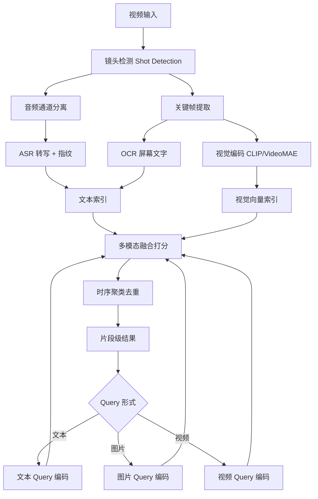
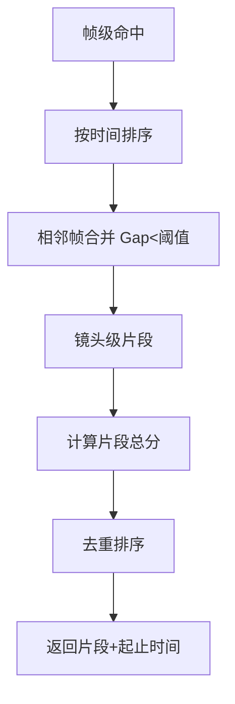

# 视频搜索

## 1. 核心概念

视频搜索跨越**视觉（画面）、音频（语音/音效）、文本（字幕/OCR）**三路信号，是最复杂的检索形态。视频检索以"镜头/场景"为原子单元，先切分再索引，最后多模态融合打分。

| 信号通道 | 内容 | 提取方式 | 检索用途 |
|---------|------|---------|---------|
| 视觉帧 | 物体、场景、动作 | CLIP/VideoMAE/关键帧 | 以图搜视频、语义检索 |
| 音频 | 语音、音乐、音效 | ASR 转写/指纹 | 内容定位、翻拍检测 |
| 文本 | 字幕、屏幕文字 | OCR/字幕文件 | 精确关键词检索 |
| 元数据 | 标题、标签、时长 | 结构化字段 | 过滤、排序 |

## 2. 常见场景

| 场景 | 输入 | 输出 | 关键要求 |
|------|------|------|---------|
| 视频平台搜索 | 自然语言描述 | 相关片段 | 语义+时效 |
| 安防事件检索 | "红衣男子骑摩托" | 视频片段 | 时空定位 |
| 电商商品视频 | 商品名/图片 | 商品片段 | 高精度匹配 |
| 版权/翻拍检测 | 参考视频 | 相似片段 | 指纹鲁棒 |
| 影视检索 | 台词/剧情描述 | 剧集片段 | 多模态融合 |
| 广告素材管理 | 风格描述 | 历史素材 | 大规模去重 |

## 3. 视频检索架构



## 4. 算法详细介绍

### 4.1 镜头检测（Shot Detection）

视频检索的基础，将连续画面切分为语义一致的镜头。

| 方法 | 原理 | 优点 | 缺点 |
|------|------|------|------|
| 像素差 | 帧间像素差突变 | 简单快速 | 敏感、误切 |
| 直方图差 | 颜色直方图距离 | 鲁棒于运动 | 淡入淡出检测差 |
| 边缘/光流 | 内容结构变化 | 检测切变 | 计算量大 |
| TransNetV2 | 深度网络时序 | 最准、含渐变 | 需训练 |
| PySceneDetect | 混合启发式 | 工程化完善 | 参数调优 |

```python
# PySceneDetect 镜头分割
from scenedetect import detect, ContentDetector

scenes = detect(
    "movie.mp4",
    ContentDetector(threshold=30.0, min_scene_len=15),
)
for scene in scenes:
    print(scene[0].get_seconds(), scene[1].get_seconds())
```

### 4.2 关键帧提取

| 策略 | 原理 | 适用 |
|------|------|------|
| 首帧/中间帧 | 固定取帧 | 场景相对稳定 |
| 视觉多样性采样 | 相似度去重选代表 | 复杂运动 |
| 每 X 秒抽帧 | 均匀抽样 | 通用 |
| 信息量打分 | 边缘/文字丰富度 | 信息密度优先 |

```python
# 场景中心帧 + 多样性去重
def extract_keyframes(scene_start, scene_end, sample_rate=5):
    frames = sample_frames(scene_start, scene_end, sample_rate)
    embeddings = encode_frames(frames)            # CLIP 编码
    selected = [frames[0]]
    for emb, frame in zip(embeddings[1:], frames[1:]):
        if max(cosine(emb, e) for e in [embeddings[0]] + selected_embs) < 0.7:
            selected.append(frame)
    return selected
```

### 4.3 视觉语义编码

| 模型 | 输入 | 输出维度 | 特点 |
|------|------|---------|------|
| CLIP (ViT-L) | 图像 | 768 | 图文对齐，以文搜图/图搜图 |
| SigLIP | 图像 | 1024 | 对比损失改进 |
| VideoMAE | 视频片段 | 1024 | 时空建模 |
| InternVideo | 视频 | 768 | 视频级语义 |
| BLIP-2 | 图+文 | 4096(LLM) | 生成式理解 |

```python
# CLIP 视频语义索引
import torch
from transformers import CLIPModel, CLIPProcessor

model = CLIPModel.from_pretrained("openai/clip-vit-base-patch32")
processor = CLIPProcessor.from_pretrained("openai/clip-vit-base-patch32")

def index_video(keyframes):
    inputs = processor(images=keyframes, return_tensors="pt")
    with torch.no_grad():
        embs = model.get_image_features(**inputs)
        embs = embs / embs.norm(dim=-1, keepdim=True)   # 归一化
    return embs

def search_by_text(query, frame_index):
    inputs = processor(text=query, return_tensors="pt")
    with torch.no_grad():
        t = model.get_text_features(**inputs)
        t = t / t.norm(dim=-1, keepdim=True)
    scores = (frame_index @ t.T).squeeze()              # 相似度
    return scores.topk(10)                              # 相关帧
```

### 4.4 OCR 与字幕通道

视频内文字（标题、屏幕、人物标识）用 OCR 提取，字幕文件直接用文本。

```python
# 视频 OCR（PaddleOCR + OpenCV 抽帧）
import cv2
from paddleocr import PaddleOCR

ocr = PaddleOCR(use_angle_cls=True)

def video_ocr(video_path, interval=2):
    cap = cv2.VideoCapture(video_path)
    results = []
    fps, t = cap.get(cv2.CAP_PROP_FPS), 0
    while cap.isOpened():
        cap.set(cv2.CAP_PROP_POS_MSEC, t * 1000)
        ok, frame = cap.read()
        if not ok:
            break
        text = " ".join(r[1][0] for r in ocr.ocr(frame)[0] or [])
        results.append((t, text))
        t += interval
    return results
```

### 4.5 多模态融合打分

| 融合方式 | 原理 | 优点 | 缺点 |
|---------|------|------|------|
| 分数加权 | α*视觉 + β*文本 | 简单可控 | 权重难调 |
| RRF | 各路排名融合 | 免调参 | 忽略分数 |
| 乘积归一 | 概率乘积 | 天然抑制单路噪声 | 一路零则全零 |
| 学习排序 | 训练打分器 | 最优 | 需标注 |
| 大模型重排 | 多模态 LLM 理解 | 最强 | 延迟成本高 |

```python
# 多模态视频检索
def multi_modal_search(query, text_scores, visual_scores, alpha=0.6):
    # text_scores: ASR/字幕检索分数, visual_scores: CLIP 视觉分数
    text_s = normalize(text_scores)
    visual_s = normalize(visual_scores)
    fused = alpha * text_s + (1 - alpha) * visual_s
    return rank_segments(fused)
```

### 4.6 时序聚类与片段定位

检索命中关键帧/片段后，需要**合并相邻命中**为完整镜头，避免重复返回。



## 5. 工程化：视频检索系统

```python
# 完整视频索引管道
class VideoIndexer:
    def __init__(self):
        self.clip = CLIPModel.from_pretrained("openai/clip-vit-base-patch32")
        self.asr = whisper.load_model("small")

    def index(self, video_path):
        scenes = detect(video_path, ContentDetector())
        entries = []
        for (start, end) in scenes:
            keyframes = extract_keyframes(start, end)
            visual = self.clip_encode(keyframes).mean(dim=0)     # 视觉向量
            audio_text = self.asr.transcribe(video_path)          # 音频转写
            entries.append({
                "start": start, "end": end,
                "visual": visual, "text": audio_text,
                "duration": end - start,
            })
        return entries

    def search(self, query, entries, top_k=5):
        # 1. 视觉语义
        q_visual = self.clip_encode_text(query)
        vis_scores = [cos(q_visual, e["visual"]) for e in entries]
        # 2. 文本（字幕/转写）BM25
        txt_scores = [bm25(query, e["text"]) for e in entries]
        # 3. 融合 + 排序
        fused = [0.6*v + 0.4*t for v, t in zip(vis_scores, txt_scores)]
        return sorted(zip(entries, fused), key=lambda x: x[1], reverse=True)[:top_k]
```

## 6. 对比优劣总结

| 方案 | 语义检索 | 精确关键词 | 时长规模 | 延迟 | 成本 |
|------|---------|-----------|---------|------|------|
| 关键帧 CLIP | 高 | 无 | 千万级帧 | 快 | 中 |
| ASR/字幕文本 | 高 | 高 | 与文本一致 | 快 | 中 |
| 视频指纹 | 无 | 无 | 百万级视频 | 快 | 低 |
| 多模态融合 | 最高 | 高 | 亿级片段 | 中 | 高 |
| 视频理解大模型 | 最高 | 高 | 小规模 | 慢 | 很高 |

## 7. 2025-2026 趋势

- **视频原生模型**：InternVideo3 / V-JEPA 直接建模时序
- **Agentic 视频检索**：Agent 结合时序推理与多轮检索
- **长视频处理**：多级索引（秒级→分钟级→整片）
- **以图搜视频普及**：CLIP 类模型驱动电商/版权
- **生成式检索**：大模型直接生成相关片段描述再匹配
