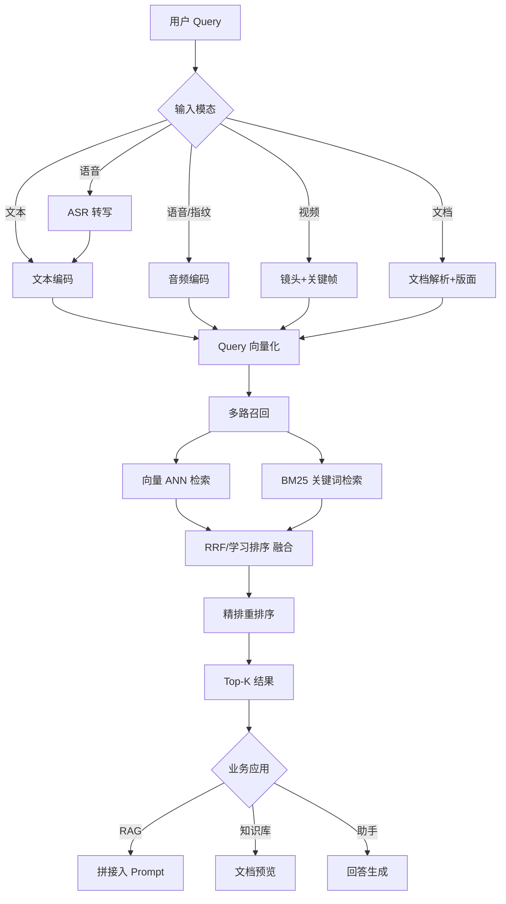
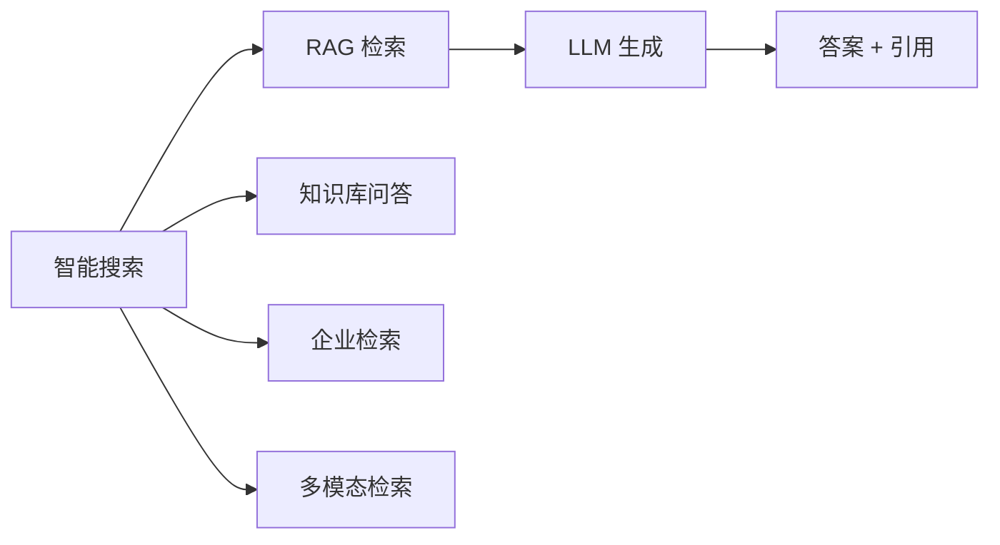

# 智能搜索

## 概述

智能搜索是连接"海量非结构化数据"与"精准用户意图"的核心引擎。从传统关键词检索（BM25/ES）到语义向量检索（Embedding/ANN），再到跨模态搜索（语音/视频/文档），搜索系统已成为 RAG、Agent、企业知识库和信息架构的基石。

本模块覆盖文本搜索、文档搜索、语音搜索、视频搜索四大子方向，以及统一的多模态检索架构。

## 目录

```
11-智能搜索/
├── README.md               # 模块总览 + 统一架构 + 文档目录
├── 01-文本搜索.md          # 关键词/语义/混合检索、BM25、RRF、重排序
├── 02-文档搜索.md          # PDF/Office 解析、版面分析、文档级检索
├── 03-语音搜索.md          # ASR 检索、语音指纹、说话人检索、语音助手
└── 04-视频搜索.md          # 镜头检测、关键帧、视觉语义检索、多模态
```

## 统一检索架构



## 各模态索引与检索方式对比

| 模态 | 输入特征 | 索引模型 | 检索方式 | 核心难点 | 代表场景 |
|------|---------|---------|---------|---------|---------|
| 文本 | 字/词/句 | BM25 / text-embedding | 倒排 / ANN | 语义理解、一词多义 | 全文检索、语义问答 |
| 文档 | 版面+文本+表格+图片 | LayoutLM / doc-embedding | 版面检索 + 文本检索 | 复杂版面解析 | 合同、论文、财报 |
| 语音 | 音频波形 | Whisper / Wav2Vec2 | ASR 转写检索 / 指纹 | 噪声、方言、说话人 | 客服质检、语音助手 |
| 视频 | 视频帧+音频+字幕 | CLIP / VideoMAE / BLIP | 多模态 ANN 检索 | 时序、镜头分割 | 视频平台、安防 |

## 搜索系统评估指标

| 指标 | 公式/定义 | 说明 |
|------|----------|------|
| Recall@K | 命中数 / 总相关数 | 召回率，RAG 关键 |
| Precision@K | 相关数 / 返回数 | 精确率 |
| MRR | 1/首个相关结果位置 | 问答场景重点 |
| NDCG@K | 归一化折损累计增益 | 排序质量 |
| MAP | 平均精确率均值 | 全量排序质量 |
| Latency P99 | 99 分位响应时间 | 在线体验 |
| QPS | 每秒查询数 | 吞吐能力 |

## 搜索与 RAG 的关系



## 选择指南

| 场景 | 推荐方案 | 原因 |
|------|---------|------|
| 通用全文检索 | Elasticsearch / OpenSearch | 成熟生态，分词过滤完善 |
| 语义检索 < 1000 万 | Qdrant + BGE 系列 | 部署简单，混合检索内置 |
| 生产 RAG | Milvus + RRf + Cohere re-rank | 分布式，支持十亿级 |
| 语音搜索 | Whisper ASR + ES/向量库 | 转写后走文本链路 |
| 视频搜索 | CLIP 关键帧 + 向量库 | 视觉语义统一表示 |
| 文档库搜索 | LayoutLM + 版面解析 + 混合检索 | 兼顾结构与语义 |
| 即时原型 | Chroma + sentence-transformers | 零配置快速验证 |
